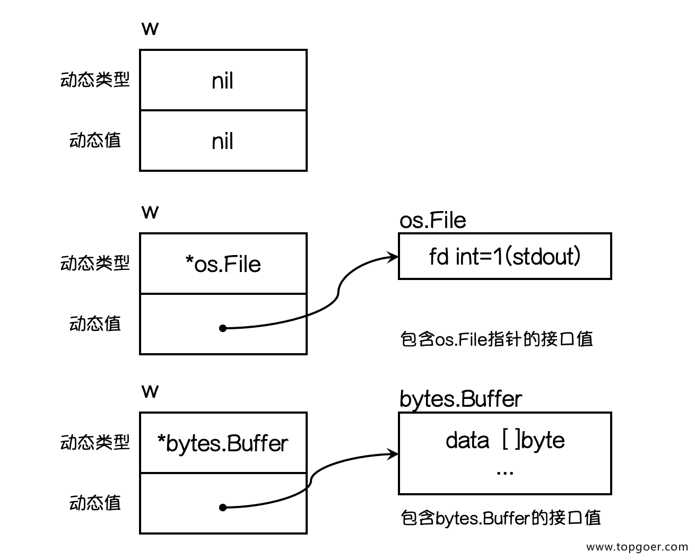

# 匿名字段

1. **go支持只提供类型而不写字段名的方式，也就是匿名字段，也称为嵌入字段**
2. **同名字段的情况**，赋值和调用的时候需要显示指定字段名。
3. **所有的内置类型和自定义类型都是可以作为匿名字段去使用**
4. 指针类型也可以做匿名字段


# 接口

接口（interface）定义了一个对象的行为规范，只定义规范不实现，由具体的对象来实现规范的细节。

**在Go语言中接口（interface）是一种类型，一种抽象的类型（牢记，死记）**。

interface是一组method的集合，是duck-type programming的一种体现。接口做的事情就像是定义一个协议（规则），只要一台机器有洗衣服和甩干的功能，我就称它为洗衣机。不关心属性（数据），只关心行为（方法）。

**当你看到一个接口类型的值时，你不知道它是什么，唯一知道的是通过它的方法能做什么。**


## 定义

go 提倡面向接口编程，应该说面向对象的语言都提倡面向接口编程，当然go是函数式编程语言。

```go
接口是一个或多个方法签名的集合。
任何类型的方法集中只要拥有该接口'对应的全部方法'签名。
就表示它 "实现" 了该接口，无须在该类型上显式声明实现了哪个接口。
这称为Structural Typing。
所谓对应方法，是指有相同名称、参数列表 (不包括参数名) 以及返回值。
当然，该类型还可以有其他方法。

接口只有方法声明，没有实现，没有数据字段。
接口可以匿名嵌入其他接口，或嵌入到结构中。
对象赋值给接口时，会发生拷贝，而接口内部存储的是指向这个复制品的指针，既无法修改复制品的状态，也无法获取指针。
只有当接口存储的类型和对象都为nil时，接口才等于nil。
接口调用不会做receiver的自动转换。
接口同样支持匿名字段方法。
接口也可实现类似OOP中的多态。
空接口可以作为任何类型数据的容器。
一个类型可实现多个接口。
接口命名习惯以 er 结尾。
```

## 接口的定义格式

```go
type 接口类型名 interface{
    方法名1( 参数列表1 ) 返回值列表1
    方法名2( 参数列表2 ) 返回值列表2
    …
}

1.接口名：使用type将接口定义为自定义的类型名。Go语言的接口在命名时，一般会在单词后面添加er，如有写操作的接口叫Writer，有字符串功能的接口叫Stringer等。接口名最好要能突出该接口的类型含义。
2.方法名：当方法名首字母是大写且这个接口类型名首字母也是大写时，这个方法可以被接口所在的包（package）之外的代码访问。
3.参数列表、返回值列表：参数列表和返回值列表中的参数变量名可以省略。

//例如
type writer interface{
    Write([]byte) error
}
```

## 条件

对象实现接口的全部方法，那么就实现了这个接口。接口就是一个需要实现的方法列表。


## 接口类型变量

那实现了接口有什么用呢？

接口类型变量能够存储所有实现了该接口的实例。 例如上面的示例中，Sayer类型的变量能够存储dog和cat类型的变量。

```go
func main() {
    var x Sayer // 声明一个Sayer类型的变量x
    a := cat{}  // 实例化一个cat
    b := dog{}  // 实例化一个dog
    x = a       // 可以把cat实例直接赋值给x
    x.say()     // 喵喵喵
    x = b       // 可以把dog实例直接赋值给x
    x.say()     // 汪汪汪
}
```

也就是接口类型变量可以接受所有实现了该接口的实列。


## 值接收者实现接口和指针接收者实现接口

```go
//使用值接收者实现接口和使用指针接收者实现接口有什么区别呢？接下来我们通过一个例子看一下其中的区别。

//我们有一个Mover接口和一个dog结构体。
type Mover interface {
    move()
}

type dog struct {}

//接收值类型的方法
func (d dog) move() {
    fmt.Println("狗会动")
}

func main() {
    var x Mover
    var wangcai = dog{} // 旺财是dog类型
    x = wangcai         // x可以接收dog类型
    var fugui = &dog{}  // 富贵是*dog类型
    x = fugui           // x可以接收*dog类型
    x.move()
}

//结论:可以看出接受值类型的方法，不管式 dog结构体还是结构体指针*dog类型的变量都可以赋值给该接口变量。因为Go语言中有对指针类型变量求值的语法糖，dog指针fugui内部会自动求值*fugui。

//接收指针类型的方法
func (d *dog) move() {
    fmt.Println("狗会动")
}

```

```go
func main() {
    var x Mover
    var wangcai = dog{} // 旺财是dog类型
    x = wangcai         // x不可以接收dog类型
    var fugui = &dog{}  // 富贵是*dog类型
    x = fugui           // x可以接收*dog类型
}
//结论：此时实现Mover接口的是*dog类型，所以不能给x传入dog类型的wangcai，此时x只能存储*dog类型的值。
```


# 类型和接口的关系

这里的类型可以理解为结构体

### 一个类型实现多个接口

这个好理解，只要类型里面实现多个接口的所有方法列表，也就实现了多个接口。

### 多个类型实现同一接口

这个也好理解，多个类型实现一个接口的所有方法即可

### 接口里面的方法，可以不是一个类型全部实现，在它嵌入的其他类型实现也是可以的


## 接口嵌套

接口与接口间可以通过嵌套创造出新的接口。

```go
// Sayer 接口
type Sayer interface {
    say()
}

// Mover 接口
type Mover interface {
    move()
}

// 接口嵌套  同时具有上面两个接口的能力
type animal interface {
    Sayer
    Mover
}
```


## 空接口

空接口是指没有定义任何方法的接口。因此任何类型都实现了空接口。（可以理解为java 里面的object）

空接口类型的变量可以存储任意类型的变量。（有点牛逼哦，海纳百川，有容乃大）

```go
func main() {
    // 定义一个空接口x
    var x interface{}
    s := "pprof.cn"
    x = s
    fmt.Printf("type:%T value:%v\n", x, x)
    i := 100
    x = i
    fmt.Printf("type:%T value:%v\n", x, x)
    b := true
    x = b
    fmt.Printf("type:%T value:%v\n", x, x)
}
```

### 牛逼的应用

1. 使用空接口实现可以接收任意类型的函数参数

   ```go
   // 空接口作为函数参数
   func show(a interface{}) {
       fmt.Printf("type:%T value:%v\n", a, a)
   }
   ```

### 空接口作为map的值

使用空接口实现可以保存任意值的字典。

```go
// 空接口作为map值
var studentInfo = make(map[string]interface{})
studentInfo["name"] = "李白"
studentInfo["age"] = 18
studentInfo["married"] = false
fmt.Println(studentInfo)
```


### 类型断言

空接口可以存储任意类型的值，那我们如何获取其存储的具体数据呢？

一个接口的值（简称接口值）是由一个具体类型和具体类型的值两部分组成的。这两部分分别称为接口的动态类型和动态值。

我们来看一个具体的例子：

```go
var w io.Writer
w = os.Stdout
w = new(bytes.Buffer)
w = nil
```



想要判断空接口中的值这个时候就可以使用类型断言，其语法格式：

```go
 x.(T)

x：表示类型为interface{}的变量
T：表示断言x可能是的类型。

该语法返回两个参数，
第一个参数是x转化为T类型后的变量
第二个值是一个布尔值，若为true则表示断言成功，为false则表示断言失败

//例子
func main() {
    var x interface{}
    x = "pprof.cn"
    v, ok := x.(string)
    if ok {
        fmt.Println(v)
    } else {
        fmt.Println("类型断言失败")
    }
}

func justifyType(x interface{}) {
    switch v := x.(type) {
    case string:
        fmt.Printf("x is a string，value is %v\n", v)
    case int:
        fmt.Printf("x is a int is %v\n", v)
    case bool:
        fmt.Printf("x is a bool is %v\n", v)
    default:
        fmt.Println("unsupport type！")
    }
}

//因为空接口可以存储任意类型值的特点，所以空接口在Go语言中的使用十分广泛。
```

关于接口需要注意的是，只有**当有两个或两个以上的具体类型必须以相同的方式进行处理时才需要定义接口。不要为了接口而写接口，那样只会增加不必要的抽象，导致不必要的运行时损耗。**