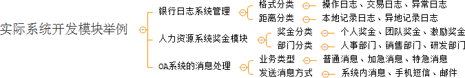

在现实生活中，某些类具有两个或多个维度的变化，如图形既可按形状分，又可按颜色分。如何设计类似于 Photoshop 这样的软件，能画不同形状和不同颜色的图形呢？如果用继承方式，m 种形状和 n 种颜色的图形就有 m×n 种，不但对应的子类很多，而且扩展困难。

当然，这样的例子还有很多，如不同颜色和字体的文字、不同品牌和功率的汽车、不同性别和职业的男女、支持不同平台和不同文件格式的媒体播放器等。如果用桥接模式就能很好地解决这些问题。

## 桥接模式的定义与特点

桥接（Bridge）模式的定义如下：将抽象与实现分离，使它们可以独立变化。它是用组合关系代替继承关系来实现，从而降低了抽象和实现这两个可变维度的耦合度。

通过上面的讲解，我们能很好的感觉到桥接模式遵循了里氏替换原则和依赖倒置原则，最终实现了开闭原则，对修改关闭，对扩展开放。这里将桥接模式的优缺点总结如下。

桥接（Bridge）模式的优点是：

- 抽象与实现分离，扩展能力强
- 符合开闭原则
- 符合合成复用原则
- 其实现细节对客户透明


缺点是：由于聚合关系建立在抽象层，要求开发者针对抽象化进行设计与编程，能正确地识别出系统中两个独立变化的维度，这增加了系统的理解与设计难度。

## 桥接模式的结构与实现

可以将抽象化部分与实现化部分分开，取消二者的继承关系，改用组合关系。

#### 1. 模式的结构

桥接（Bridge）模式包含以下主要角色。

1. 抽象化（Abstraction）角色：定义抽象类，并包含一个对实现化对象的引用。
2. 扩展抽象化（Refined Abstraction）角色：是抽象化角色的子类，实现父类中的业务方法，并通过组合关系调用实现化角色中的业务方法。
3. 实现化（Implementor）角色：定义实现化角色的接口，供扩展抽象化角色调用。
4. 具体实现化（Concrete Implementor）角色：给出实现化角色接口的具体实现。

```java
package designPatterns.structure;

/**
 * 桥接模式
 *
 * 女生衣服的选择
 * 衣服有很多种，按照颜色分  红色 和黑色
 * 按照 厚薄分  厚 和 薄的去 还可按照其他形式分 这里只是举例
 * 按照衣服类型  分为 风衣 和雨衣
 * @Author yongzhi
 * @Date 2021/3/19 14:10
 **/
public class BridgeTest {
    public static void main(String[] args) {

        //客服端就可以进行搭配
        Color color = new Red();
        Dress dress = new WindDress();
        //这里设置颜色
        dress.setColor(color);

        String name = dress.getName();
        System.out.println(name);
    }
}

//实现话角色
interface Color{
    String getColor();
}

//具体的颜色
class Red implements Color{

    @Override
    public String getColor() {
        return "红色";
    }
}
//具体的颜色
class Black implements Color{
    @Override
    public String getColor() {
        return null;
    }
}

//抽象化角色 衣服
abstract class Dress{

    protected Color color;

    public void setColor(Color color){
        this.color = color;
    }

    public abstract String getName();
}

//扩展抽象化角色  风衣
class WindDress extends Dress{

    @Override
    public String getName() {
        return color.getColor() + "风衣";
    }
}
//扩展抽象化角色  雨衣
class RainDress extends Dress{
    @Override
    public String getName() {
        return color.getColor() + "雨衣";
    }
}
```

## 桥接模式的应用场景

当一个类内部具备两种或多种变化维度时，使用桥接模式可以解耦这些变化的维度，使高层代码架构稳定。

桥接模式通常适用于以下场景。

1. 当一个类存在两个独立变化的维度，且这两个维度都需要进行扩展时。
2. 当一个系统不希望使用继承或因为多层次继承导致系统类的个数急剧增加时。
3. 当一个系统需要在构件的抽象化角色和具体化角色之间增加更多的灵活性时。


桥接模式的一个常见使用场景就是替换继承。我们知道，继承拥有很多优点，比如，抽象、封装、多态等，父类封装共性，子类实现特性。继承可以很好的实现代码复用（封装）的功能，但这也是继承的一大缺点。

因为父类拥有的方法，子类也会继承得到，无论子类需不需要，这说明继承具备强侵入性（父类代码侵入子类），同时会导致子类臃肿。因此，在[设计模式](http://c.biancheng.net/design_pattern/)中，有一个原则为优先使用组合/聚合，而不是继承。





很多时候，我们分不清该使用继承还是组合/聚合或其他方式等，其实可以从现实语义进行思考。因为软件最终还是提供给现实生活中的人使用的，是服务于人类社会的，软件是具备现实场景的。当我们从纯代码角度无法看清问题时，现实角度可能会提供更加开阔的思路。

## 桥接模式模式的扩展

在软件开发中，有时桥接（Bridge）模式可与[适配器模式](http://c.biancheng.net/view/1361.html)联合使用。当桥接（Bridge）模式的实现化角色的接口与现有类的接口不一致时，可以在二者中间定义一个适配器将二者连接起来，


# 总结

桥接模式，如果一个对象有多种维度，把多种维度进行组合得一种方式。通过继承和组合得形式实现。