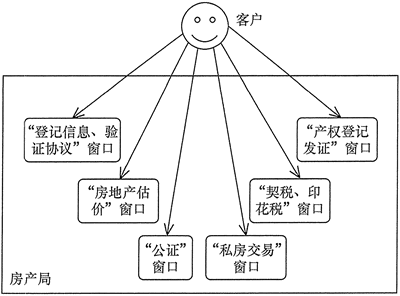

在现实生活中，常常存在办事较复杂的例子，如办房产证或注册一家公司，有时要同多个部门联系，这时要是有一个综合部门能解决一切手续问题就好了。

软件设计也是这样，当一个系统的功能越来越强，子系统会越来越多，客户对系统的访问也变得越来越复杂。这时如果系统内部发生改变，客户端也要跟着改变，这违背了“开闭原则”，也违背了“迪米特法则”，所以有必要为多个子系统提供一个统一的接口，从而降低系统的耦合度，这就是外观模式的目标。

图 1 给出了客户去当地房产局办理房产证过户要遇到的相关部门。



图1 办理房产证过户的相关部门

## 外观模式的定义与特点

外观（Facade）模式又叫作门面模式，是一种通过为多个复杂的子系统提供一个一致的接口，而使这些子系统更加容易被访问的模式。该模式对外有一个统一接口，外部应用程序不用关心内部子系统的具体细节，这样会大大降低应用程序的复杂度，提高了程序的可维护性。

在日常编码工作中，我们都在有意无意的大量使用外观模式。只要是高层模块需要调度多个子系统（2个以上的类对象），我们都会自觉地创建一个新的类封装这些子系统，提供精简的接口，让高层模块可以更加容易地间接调用这些子系统的功能。尤其是现阶段各种第三方SDK、开源类库，很大概率都会使用外观模式。

外观（Facade）模式是“迪米特法则”的典型应用，它有以下主要优点。

1. 降低了子系统与客户端之间的耦合度，使得子系统的变化不会影响调用它的客户类。
2. 对客户屏蔽了子系统组件，减少了客户处理的对象数目，并使得子系统使用起来更加容易。
3. 降低了大型软件系统中的编译依赖性，简化了系统在不同平台之间的移植过程，因为编译一个子系统不会影响其他的子系统，也不会影响外观对象。


外观（Facade）模式的主要缺点如下。

1. 不能很好地限制客户使用子系统类，很容易带来未知风险。
2. 增加新的子系统可能需要修改外观类或客户端的源代码，违背了“开闭原则”。

## 外观模式的结构与实现

外观（Facade）模式的结构比较简单，主要是定义了一个高层接口。它包含了对各个子系统的引用，客户端可以通过它访问各个子系统的功能。现在来分析其基本结构和实现方法。

#### 1. 模式的结构

外观（Facade）模式包含以下主要角色。

1. 外观（Facade）角色：为多个子系统对外提供一个共同的接口。
2. 子系统（Sub System）角色：实现系统的部分功能，客户可以通过外观角色访问它。
3. 客户（Client）角色：通过一个外观角色访问各个子系统的功能。

```java
package designPatterns.structure;

/**
 * @Author yongzhi
 * @Date 2021/3/19 16:47
 **/
public class FacadeTest {
    public static void main(String[] args) {
        Facade f = new Facade();
        f.method();
    }
}

//外观角色
class Facade {
    private SubSystem01 obj1 = new SubSystem01();
    private SubSystem02 obj2 = new SubSystem02();
    private SubSystem03 obj3 = new SubSystem03();
    public void method() {
        obj1.method1();
        obj2.method2();
        obj3.method3();
    }
}
//子系统角色
class SubSystem01 {
    public void method1() {
        System.out.println("子系统01的method1()被调用！");
    }
}
//子系统角色
class SubSystem02 {
    public void method2() {
        System.out.println("子系统02的method2()被调用！");
    }
}
//子系统角色
class SubSystem03 {
    public void method3() {
        System.out.println("子系统03的method3()被调用！");
    }
}


```

## 外观模式的应用场景

通常在以下情况下可以考虑使用外观模式。

1. 对分层结构系统构建时，使用外观模式定义子系统中每层的入口点可以简化子系统之间的依赖关系。
2. 当一个复杂系统的子系统很多时，外观模式可以为系统设计一个简单的接口供外界访问。
3. 当客户端与多个子系统之间存在很大的联系时，引入外观模式可将它们分离，从而提高子系统的独立性和可移植性。

## 外观模式的扩展

在外观模式中，当增加或移除子系统时需要修改外观类，这违背了“开闭原则”。如果引入抽象外观类，则在一定程度上解决了该问题


# 总结

外观模式可以理解为一个中介，客服端只需要更中介打交道，中介里面包含了其他业务功能，客服端不需要去管业务功能。