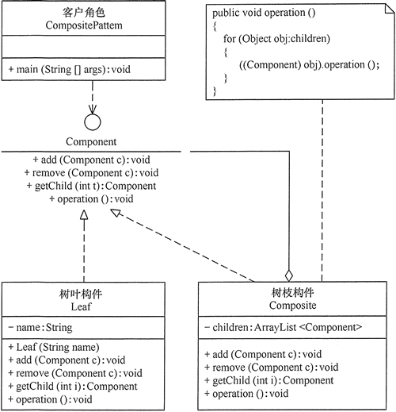

在现实生活中，存在很多“部分-整体”的关系，例如，大学中的部门与学院、总公司中的部门与分公司、学习用品中的书与书包、生活用品中的衣服与衣柜、以及厨房中的锅碗瓢盆等。在软件开发中也是这样，例如，文件系统中的文件与文件夹、窗体程序中的简单控件与容器控件等。对这些简单对象与复合对象的处理，如果用组合模式来实现会很方便。

## 组合模式的定义与特点

组合（Composite Pattern）模式的定义：有时又叫作整体-部分（Part-Whole）模式，它是一种将对象组合成树状的层次结构的模式，用来表示“整体-部分”的关系，使用户对单个对象和组合对象具有一致的访问性，属于结构型[设计模式](http://c.biancheng.net/design_pattern/)。

组合模式一般用来描述整体与部分的关系，它将对象组织到树形结构中，顶层的节点被称为根节点，根节点下面可以包含树枝节点和叶子节点，树枝节点下面又可以包含树枝节点和叶子节点，树形结构图如下。


由上图可以看出，其实根节点和树枝节点本质上属于同一种数据类型，可以作为容器使用；而叶子节点与树枝节点在语义上不属于用一种类型。但是在组合模式中，会把树枝节点和叶子节点看作属于同一种数据类型（用统一接口定义），让它们具备一致行为。

这样，在组合模式中，整个树形结构中的对象都属于同一种类型，带来的好处就是用户不需要辨别是树枝节点还是叶子节点，可以直接进行操作，给用户的使用带来极大的便利。

组合模式的主要优点有：

1. 组合模式使得客户端代码可以一致地处理单个对象和组合对象，无须关心自己处理的是单个对象，还是组合对象，这简化了客户端代码；
2. 更容易在组合体内加入新的对象，客户端不会因为加入了新的对象而更改源代码，满足“开闭原则”；


其主要缺点是：

1. 设计较复杂，客户端需要花更多时间理清类之间的层次关系；
2. 不容易限制容器中的构件；
3. 不容易用继承的方法来增加构件的新功能；

## 组合模式的结构与实现

组合模式的结构不是很复杂，下面对它的结构和实现进行分析。

### 1. 模式的结构

组合模式包含以下主要角色。

1. 抽象构件（Component）角色：它的主要作用是为树叶构件和树枝构件声明公共接口，并实现它们的默认行为。在透明式的组合模式中抽象构件还声明访问和管理子类的接口；在安全式的组合模式中不声明访问和管理子类的接口，管理工作由树枝构件完成。（总的抽象类或接口，定义一些通用的方法，比如新增、删除）
2. 树叶构件（Leaf）角色：是组合中的叶节点对象，它没有子节点，用于继承或实现抽象构件。
3. 树枝构件（Composite）角色 / 中间构件：是组合中的分支节点对象，它有子节点，用于继承和实现抽象构件。它的主要作用是存储和管理子部件，通常包含 Add()、Remove()、GetChild() 等方法。


组合模式分为透明式的组合模式和安全式的组合模式。

#### (1) 透明方式

在该方式中，由于抽象构件声明了所有子类中的全部方法，所以客户端无须区别树叶对象和树枝对象，对客户端来说是透明的。但其缺点是：树叶构件本来没有 Add()、Remove() 及 GetChild() 方法，却要实现它们（空实现或抛异常），这样会带来一些安全性问题。其结构图如图 1 所示。



图1 透明式的组合模式的结构图


#### (2) 安全方式

在该方式中，将管理子构件的方法移到树枝构件中，抽象构件和树叶构件没有对子对象的管理方法，这样就避免了上一种方式的安全性问题，但由于叶子和分支有不同的接口，客户端在调用时要知道树叶对象和树枝对象的存在，所以失去了透明性。其结构图如图 2 所示。


图2 安全式的组合模式的结构图

### 2. 模式的实现

假如要访问集合 c0={leaf1,{leaf2,leaf3}} 中的元素，其对应的树状图如图 3 所示。


图3 集合c0的树状图

## 组合模式的应用场景

前面分析了组合模式的结构与特点，下面分析它适用的以下应用场景。

1. 在需要表示一个对象整体与部分的层次结构的场合。
2. 要求对用户隐藏组合对象与单个对象的不同，用户可以用统一的接口使用组合结构中的所有对象的场合。

## 组合模式的扩展

如果对前面介绍的组合模式中的树叶节点和树枝节点进行抽象，也就是说树叶节点和树枝节点还有子节点，这时组合模式就扩展成复杂的组合模式了，如 [Java](http://c.biancheng.net/java/) AWT/[Swing](http://c.biancheng.net/swing/) 中的简单组件 JTextComponent 有子类 JTextField、JTextArea，容器组件 Container 也有子类 Window、Panel。


透明式

```java
package designPatterns.structure;

import java.lang.reflect.Array;
import java.util.ArrayList;

/**
 * 组合模式
 * @Author yongzhi
 * @Date 2021/3/19 17:51
 **/
public class CompositePatternTest {
    public static void main(String[] args) {

        //树枝节点
        Component c = new Composite();

        //在添加一个数枝节点
        Component c1 = new Composite();

        c.add(c1);

        //树叶节点
        Component l = new Leaf("1.text");

        Component l1 = new Leaf("2.text");

        //将l l1 添加到c1
        c.add(l);
        c1.add(l1);

        c.operation();

    }
}

//抽象构构件
interface Component{
    public void add(Component c);

    public void remove(Component c);

    public Component getChild(int i);

    public void operation();
}

//树叶构建
class Leaf implements Component{
    private String name;

    public Leaf(String name){
        this.name = name;
    }

    @Override
    public void add(Component c) {

    }

    @Override
    public void remove(Component c) {

    }

    @Override
    public Component getChild(int i) {
        return null;
    }

    @Override
    public void operation() {
        System.out.println("树叶:" + name + "  被访问！");
    }
}

//树枝构建
class Composite implements Component{
    private ArrayList<Component> children = new ArrayList<>();

    @Override
    public void add(Component c) {
        children.add(c);
    }

    @Override
    public void remove(Component c) {
        children.remove(c);
    }

    @Override
    public Component getChild(int i) {
        return children.get(i);
    }

    @Override
    public void operation() {
        System.out.println("这个是树枝节点，这里可以选择可以进行一些操作");
        for (Component c : children){
            c.operation();
        }
    }
}
//这个是树枝节点，这里可以选择可以进行一些操作
//这个是树枝节点，这里可以选择可以进行一些操作
//树叶:2.text  被访问！
//树叶:1.text  被访问！
```


# 一句话总结

组合模式，组合模式可以理解为树结构的模式，先抽象出树枝和树叶的结构，在根据对应的树枝和树叶做对应的实现，抽象的类或者接口定义公共的方法。组合模式具有相似对象的包含关系，生活中比价比较常见的如，window 文件系统，菜单目录系统等等。