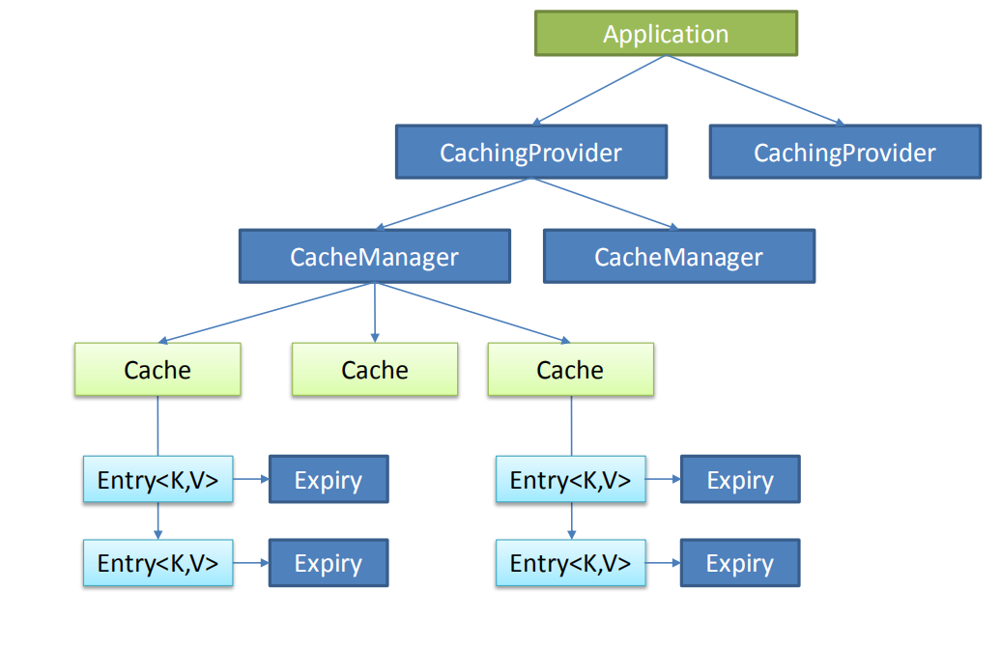

# JSR107 规范
是定制java  缓存的一个规范

Java Caching定义了5个核心接口，分别是CachingProvider, CacheManager, Cache, Entry
和 Expiry。 
+ CachingProvider定义了创建、配置、获取、管理和控制多个CacheManager。一个应用可
以在运行期访问多个CachingProvider。 
+ CacheManager定义了创建、配置、获取、管理和控制多个唯一命名的Cache，这些Cache
存在于CacheManager的上下文中。一个CacheManager仅被一个CachingProvider所拥有。
+ Cache是一个类似Map的数据结构并临时存储以Key为索引的值。一个Cache仅被一个
CacheManager所拥有。
+ Entry是一个存储在Cache中的key-value对。
+ Expiry 每一个存储在Cache中的条目有一个定义的有效期。一旦超过这个时间，条目为过期
的状态。一旦过期，条目将不可访问、更新和删除。缓存有效期可以通过ExpiryPolicy设置。

1. 缓存的一个架构图

# Spring缓存的抽象

Spring从3.1开始定义了org.springframework.cache.Cache
和org.springframework.cache.CacheManager接口来统一不同的缓存技术；
并支持使用JCache（JSR-107）注解简化我们开发；
1. Cache接口为缓存的组件规范定义，包含缓存的各种操作集合；
2. Cache接口下Spring提供了各种xxxCache的实现；如RedisCache，EhCacheCache , 
ConcurrentMapCache等；
1. 每次调用需要缓存功能的方法时，Spring会检查检查指定参数的指定的目标方法是否
已经被调用过；如果有就直接从缓存中获取方法调用后的结果，如果没有就调用方法
并缓存结果后返回给用户。下次调用直接从缓存中获取。
2. 使用Spring缓存抽象时我们需要关注以下两点；
+ 确定方法需要被缓存以及他们的缓存策略
+ 从缓存中读取之前缓存存储的数据

## Spring几个重要概念&缓存注解
|名字 | 介绍
|------|-------|
|Cache |缓存接口，定义缓存操作。实现有：RedisCache、EhCacheCache、ConcurrentMapCache等|
|CacheManager |缓存管理器，管理各种缓存（Cache）组件|
|@Cacheable |主要针对方法配置，能够根据方法的请求参数对其结果进行缓存|
|@CacheEvict |清空缓存|
|@CachePut |保证方法被调用，又希望结果被缓存。
|@EnableCaching| 开启基于注解的缓存
|keyGenerator |缓存数据时key生成策略
|serialize |缓存数据时value序列化策略

## @Cacheable @CacheEvict  @CachePut 几个主要的参数

| 名字| 介绍| 例子|
|-----------------|-------------------------------|-----------------------------------------------------------------------|
| value | 缓存的名称，在 spring 配置文件中定义，必须指定至少一个| 例如：@Cacheable(value=”mycache”) 或者@Cacheable(value={”cache1”,”cache2”}|
|key |缓存的 key，可以为空，如果指定要按照 SpEL 表达式编写，如果不指定，则缺省按照方法的所有参数进行组合|例如：@Cacheable(value=”testcache”,key=”#userName”)|
|condition |缓存的条件，可以为空，使用 SpEL 编写，返回 true 或者 false，只有为 true 才进行缓存/清除缓存，在调用方法之前之后都能判断|例如：@Cacheable(value=”testcache”,condition=”#userName.length()>2”)|
|allEntries(@CacheEvict )|是否清空所有缓存内容，缺省为 false，如果指定为true，则方法调用后将立即清空所有缓存| 例如：@CachEvict(value=”testcache”,allEntries=true)
|beforeInvocation(@CacheEvict)|是否在方法执行前就清空，缺省为 false，如果指定为 true，则在方法还没有执行的时候就清空缓存，缺省情况下，如果方法执行抛出异常，则不会清空缓存|例如：@CachEvict(value=”testcache”，beforeInvocation=true)
|unless(@CachePut)(@Cacheable)|用于否决缓存的，不像condition，该表达式只在方法执行之后判断，此时可以拿到返回值result进行判断。条件为true不会缓存，fasle才缓存|例如：@Cacheable(value=”testcache”,unless=”#result == null”)|

## spel依赖的元数据

|名字 |位置 |描述 |示例|
|--------|—------|------|-------|
|methodName|root object |当前被调用的方法名 |#root.methodName|
|target |root object |当前被调用的目标对象 #root.target|
|targetClass root object |当前被调用的目标对象类 #root.targetClass
|args root object |当前被调用的方法的参数列表 #root.args[0]
|caches root object |当前方法调用使用的缓存列表（如@Cacheable(value={"cache1", "cache2"})），则有两个cache
#root.caches[0].name
argument 
name
|evaluation |context 方法参数的名字. 可以直接 #参数名 ，也可以使用 #p0或#a0 的
形式，0代表参数的索引；
#iban 、 #a0 、 #p0
|result |evaluation context 方法执行后的返回值（仅当方法执行之后的判断有效，如
‘unless’，’cache put’的表达式 ’cache evict’的表达式
beforeInvocation=false）
#result