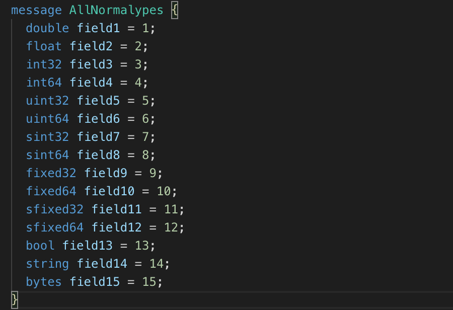
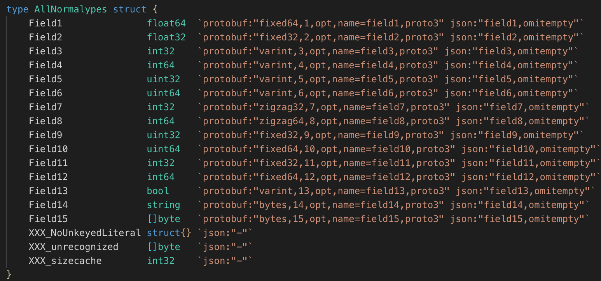

# 简介

[官网](https://developers.google.cn/protocol-buffers)

[中文教程](https://colobu.com/2019/10/03/protobuf-ultimate-tutorial-in-go/)

Protocol Buffer (简称Protobuf) 是Google出品的性能优异、跨语言、跨平台的序列化库。

Xml、Json是目前常用的数据交换格式，它们直接使用字段名称维护序列化后类实例中字段与数据之间的映射关系，一般用字符串的形式保存在序列化后的字节流中。消息和消息的定义相对独立，可读性较好。但序列化后的数据字节很大，序列化和反序列化的时间较长，数据传输效率不高。

 Protobuf和Xml、Json序列化的方式不同，采用了二进制字节的序列化方式，用字段索引和字段类型通过算法计算得到字段之前的关系映射，从而达到更高的时间效率和空间效率，特别适合对数据大小和传输速率比较敏感的场合使用。

使用流程
1. 需要编写协议配置文件
2. 需要通过protocol编译软件将配置文件编译成对应语言的代码

## 历史

2001年初，Protobuf首先在Google内部创建， 我们把它称之为 `proto1`，一直以来在Google的内部使用，其中也不断的演化，根据使用者的需求也添加很多新的功能，一些内部库依赖它。几乎每个Google的开发者都会使用到它。

Google开始开源它的内部项目时，因为依赖的关系，所以他们决定首先把Protobuf开源出去。 proto1在演化的过程中有些混乱，所以Protobuf的开发者重写了Protobuf的实现，保留了proto1的大部分设计，以及proto1的很多的想法。但是开源的proto2不依赖任何的Google的库，代码也相当的清晰。2008年7月7日，Protobuf开始公布出来。

Protobuf公布出来也得到了大家的广泛的关注， 逐步地也得到了大家的认可，很多项目也采用Protobuf进行消息的通讯，还有基于Protobuf的微服务框架GRPC。在使用的过程中，大家也提出了很多的意见和建议，Protobuf也在演化，于2016年推出了Proto3。 Proto3简化了proto2的开发，提高了开发的效能，但是也带来了版本不兼容的问题。

目前Protobuf的稳定版本是3.9.2，于2019年9月23日发布。由于很多公司很早的就采用了Protobuf，所以很多项目还在使用proto2协议，目前是proto2和proto3同时在使用的状态。

Protocol Buffer名称来自于初期一个主要的类的名称`ProtocolBuffer`。

Google当前并没有Protobuf的相关专利，所以不必担心侵权的问题。

## 序列化

序列化(serialization、marshalling)的过程是指将数据结构或者对象的状态转换成可以存储(比如文件、内存)或者传输的格式(比如网络)。反向操作就是反序列化(deserialization、unmarshalling)的过程。

1987年曾经的Sun Microsystems发布了XDR。

二十世纪九十年代后期，XML开始流行，它是一种人类易读的基于文本的编码方式，易于阅读和理解，但是失去了紧凑的基于字节流的编码的优势。

JSON是一种更轻量级的基于文本的编码方式，经常用在client/server端的通讯中。

YAML类似JSON，新的特性更强大，更适合人类阅读，也更紧凑。

还有苹果系统的property list。

除了上面这些和Protobuf，还有许许多多的序列化格式，比如Thrift、Avro、BSON、CBOR、MessagePack, 还有很多非跨语言的编码格式。项目[gosercomp](https://github.com/smallnest/gosercomp)对比了各种go的序列化库，包括序列化和反序列的性能，以及序列化后的数据大小。总体来说Protobuf序列化和反序列的性能都是比较高的，编码后的数据大小也不错。

**Protobuf支持很多语言，比如C++、C#、Dart、Go、Java、Python、Rust等，同时也是跨平台的，所以得到了广泛的应用。**

Protobuf包含序列化格式的定义、各种语言的库以及一个IDL编译器。**正常情况下你需要定义proto文件，然后使用IDL编译器编译成你需要的语言。**

## proto教程

鉴于官方推荐新代码采用proto3,这个教程主要介绍proto3的开发。官方建议新项目采用proto3，老项目因为兼容性的问题继续使用proto2,并且会长时间的支持proto2。

### proto3的改变

官方的发布日志中列举了proto3的[改变](https://github.com/protocolbuffers/protobuf/releases/tag/v3.0.0)：

- 移除了原始值字段的出现逻辑。
- 移除了`required`字段
- 移除了缺省值
- 移除了`unknown`字段 （3.5中又加上了）
- 移除了扩展，使用`Any`代替
- 修复了未知的枚举值的语义
- 添加了map类型
- 添加了一些标准类似，比如time、动态数据的呈现
- 可以使用JSON编码代替二进制proto编码

### 一个简单的例子

首先让我们看一个简单的例子`simple.proto`:

```protobuf
syntax = "proto3";

message SearchRequest {
  string query = 1;
  int32 page_number = 2;
  int32 result_per_page = 3;
}
```

第一行指定protobuf的版本，这里是以`proto3`格式定义。你还可以指定为`proto2`。如果没有指定，默认以`proto2`格式定义。

它定义了一个message类型: `SearchRequest`， 它包含三个字段`query`、`page_number`、`result_per_page`,它会被**protoc**编译成不同的编程语言的相应对象，比如Java中的class、Go中的struct等。

字段是以`[ "repeated" ] type fieldName "=" fieldNumber [ "[" fieldOptions "]" ] ";"`格式定义的。这个例子是一个简单的例子，采用了`type fieldName "=" fieldNumber`格式定义的。

比如第一个字段`query`, 首先是它的类型`string`，其次是字段的名称，然后是等号`=`, 之后是字段的序号，然后是分号。

复杂的结构，前面可以定义为`repeated`, 序号之后可以定义一些可选项。

这是普通的字段定义，当然还有一些复杂的一些字段定义，比如`Oneof`、`Map`、`Reserved`、`enum`定义。

在当前的目录下执行

```
protoc -I=. -I/usr/local/include -I=$(GOPATH)/src --go_out=. simple.proto
```
可以将这个proto编译成Go的代码，因为这里我们使用了`go_out`输出格式。

`-I`指定protoc的搜索import的proto的文件夹。在`MacOS`操作系统中protobuf把一些扩展的proto放在了`/usr/local/include`对应的文件夹中，一些第三方的Go库放在了gopath对应的包下，所以这里都把它们加上了。对于这个简单的例子，实际是不需要的。

### 输出不同代码的参数

- `cpp_out`用来生成C++代码
- go_out生成go代码
- `java_out`产生Java代码
- `python_out`产生python代码
- 类似地还有`csharp_out`、`objc_out`、`ruby_out`、`php_out`等参数。

一些第三方的插件也会定义自己的输出插件，比如`gofast_out`使用gogo库生成代码， `rust_out`产生rust代码。

生成的代码我们指定放在本地文件夹中(`--go_out=.`)。

生成的数据结构如下，它还包括一些辅助方法以及`GetXXXX`读取字段的方法。

```go
type SearchRequest struct {
	Query                string   `protobuf:"bytes,1,opt,name=query,proto3" json:"query,omitempty"`
	PageNumber           int32    `protobuf:"varint,2,opt,name=page_number,json=pageNumber,proto3" json:"page_number,omitempty"`
	ResultPerPage        int32    `protobuf:"varint,3,opt,name=result_per_page,json=resultPerPage,proto3" json:"result_per_page,omitempty"`
	XXX_NoUnkeyedLiteral struct{} `json:"-"`
	XXX_unrecognized     []byte   `json:"-"`
	XXX_sizecache        int32    `json:"-"`
}

func (m *SearchRequest) Reset()         { *m = SearchRequest{} }
func (m *SearchRequest) String() string { return proto.CompactTextString(m) }
func (*SearchRequest) ProtoMessage()    {}
func (*SearchRequest) Descriptor() ([]byte, []int) {
	return fileDescriptor_5ffd045dd4d042c1, []int{0}
}
func init() {
	proto.RegisterType((*SearchRequest)(nil), "abc.SearchRequest")
}
......
```

### proto3 格式

### 版本定义

首先我们会定义proto的版本。

```protobuf
syntax = "proto3";
```

### 引入其它proto文件

```protobuf
import  "other.proto";
import public "other2.proto";
import weak "other.proto";
```

比较少使用的是`public`和`weak`关键字。默认情况下

- `weak`引入的文件允许不存在(missing)，只为了google内部使用。
- `public`具有传递性，如果你在文件中通过`public`引入第三方的proto文件，那么引入你这个文件同时也会引入第三方的proto。

我们一般忽略`public`和`weak`关键字，这两个关键字也没有在规范中详细进行介绍。

### package

定义proto的包名，**包名可以避免对message 类型之间的名字冲突，同名的Message可以通过package进行区分**。

在没有为特定语言定义`option xxx_package`的时候，它还可以用来生成特定语言的包名，比如Java package, go package。

```protobuf
package foo.bar;
```

### option

option可以用在proto的scope中，或者message、enum、service的定义中。
可以是Protobuf定义的option，或者自定义的option。

option的定义格式是`"option" optionName "=" constant ";"`,比如:

```protobuf
option java_package = "com.example.foo";
```

一些Protobuf定义的option:

- java_package
- java_multiple_files
- java_outer_classname
- optimize_for
- cc_enable_arenas
- objc_class_prefix
- deprecated

自定义的例子：

```protobuf
option (gogoproto.testgen_all) = true;
option (gogoproto.populate_all) = true;
option (gogoproto.benchgen_all) = true;


message NidRepPackedNative {
	repeated double Field1 = 1 [(gogoproto.nullable) = false, packed = true];
	repeated float Field2 = 2 [(gogoproto.nullable) = false, packed = true];
	repeated int32 Field3 = 3 [(gogoproto.nullable) = false, packed = true];
}
```

### 普通字段

前面讲过，普通字段的格式为`field = [ "repeated" ] type fieldName "=" fieldNumber [ "[" fieldOptions "]" ] ";"`

`repeated`允许字段重复，对于Go语言来说，它会编译成数组(`slice of type`)类型的格式。

其中类型可以是以下几种类型：

- 数字类型： double、float、int32、int64、uint32、uint64、sint32、sint64: 存储长度可变的浮点数、整数、无符号整数和有符号整数
- 存储固定大小的数字类型：fixed32、fixed64、sfixed32、sfixed64: 存储空间固定
- 布尔类型: bool
- 字符串: string
- bytes: 字节数组
- messageType: 消息类型
- enumType:枚举类型

**字段名、消息名、枚举类型名、map名、服务名等名称首字母必须是字母类型，然后可以是字母、数字或者下划线_**。

下面是一个包含各种类型(Scalar Value Types)的proto文件。
[](https://colobu.com/2019/10/03/protobuf-ultimate-tutorial-in-go/normal-types.png)

编译成Go文件：`protoc -I=. -I/usr/local/include -I=$(GOPATH)/src --go_out=. types.proto`。
[](https://colobu.com/2019/10/03/protobuf-ultimate-tutorial-in-go/normal-types-in-go.png)

proto类型和各语言的对应关系可以参考文档：[Scalar Value Types](https://developers.google.com/protocol-buffers/docs/proto3#scalar)

同一个message的每个字段都有唯一一个编号，并且建议终生这个编号都不要改变。

### Oneof

如果你有一组字段，同时最多允许这一组中的一个字段出现，就可以使用`Oneof`定义这一组字段，这有点Union的意思，但是Oneof允许你设置零各值。

因为proto3没有办法区分正常的值是否是设置了还是取得缺省值(比如int64类型字段，如果它的值是0，你无法判断数据是否包含这个字段，因为0几可能是数据中设置的值，也可能是这个字段的零值)，所以你可以通过Oneof取得这个功能，因为Oneof有判断字段是否设置的功能。

```protobuf
syntax = "proto3";

package abc;

message OneofMessage {
    oneof test_oneof {
      string name = 4;
      int64 value = 9;
    }
  }
```

`oneof`字段不能同时使用`repeated`。

### map类型

map类型需要设置键和值的类型，格式是`"map" "<" keyType "," type ">" mapName "=" fieldNumber [ "[" fieldOptions "]"`。

比如:

```protobuf
map<int64,string> values = 1;
```

`map`字段不能同时使用`repeated`。

### Reserved

**Reserved可以用来指明此message不使用某些字段，也就是忽略这些字段。**

可以通过字段编号范围或者字段名称指定保留的字段：

```protobuf
syntax = "proto3";

package abc;

message AllNormalypes {
  reserved 2, 4 to 6;
  reserved "field14", "field11";
  double field1 = 1;
  // float field2 = 2;
  int32 field3 = 3;
  // int64 field4 = 4;
  // uint32 field5 = 5;
  // uint64 field6 = 6;
  sint32 field7 = 7;
  sint64 field8 = 8;
  fixed32 field9 = 9;
  fixed64 field10 = 10;
  // sfixed32 field11 = 11;
  sfixed64 field12 = 12;
  bool field13 = 13;
  // string field14 = 14;
  bytes field15 = 15;
}
```

声明保留的字段你就不要再定义了，否则编译的时候会出错。

### 枚举类型

枚举类型也是常用的一种类型，**它限定字段的值只能取某个特定的值**，比如星期类型只能取周一到周日七个值。

注意枚举类型的定义采用C++ scoping规则，也就是枚举值是枚举类型的兄弟类型，而不是子类型，所以避免在同一个package定义重名的枚举字段。

```protobuf
enum EnumAllowingAlias {
  option allow_alias = true;
  UNKNOWN = 0;
  STARTED = 1;
  RUNNING = 1;
}
enum EnumNotAllowingAlias {
  UNKNOWN2 = 0;
  STARTED2 = 1;
  // RUNNING = 1; 
}
```

虽然产生的Go代码会给产生的类型加上前缀，但是proto的定义还是需要避免重名(把上面的STARTED2改成STARTED试试)。

如果设置`allow_alias`，允许字段编号重复，`RUNNING`是`STARTED`的别名。

枚举的常量必须是一个32比特的整数，从效率的角度考虑，不推荐采用负数。

第一个枚举值必须是0，而且必须定义。

你也可以把枚举类型定义到message中：

```
message SearchRequest {
  string query = 1;
  int32 page_number = 2;
  int32 result_per_page = 3;
  enum Corpus {
    UNIVERSAL = 0;
    WEB = 1;
    IMAGES = 2;
    LOCAL = 3;
    NEWS = 4;
    PRODUCTS = 5;
    VIDEO = 6;
  }
  Corpus corpus = 4;
}
```

对于无法识别的枚举值，不同的语言有不同的处理。对于Go语言来说，因为枚举类型以int32来表示，所以对应的值依然用int32解析出来，只不过没有对应的枚举值而已。这种情况还是会存在的，比如proto有改动，或者代码强行设置了一个未知的枚举值。

### 使用其它类型

你也可以使用其它message类型作为字段的类型值。因为前面在介绍字段的类型的时候说了，类型可以是消息类型和枚举类型，枚举类型如上所示，而消息类型如下所示：

```
message SearchResponse {
  repeated Result results = 1;
}

message Result {
  string url = 1;
  string title = 2;
  repeated string snippets = 3;
}
```

如果要使用的类型在其它proto文件中定义，你需要使用`import`把对应的文件引入进来。

### 嵌套类型

嵌套类型就是消息类型里面定义了消息类型：

```
message SearchResponse {
  message Result {
    string url = 1;
    string title = 2;
    repeated string snippets = 3;
  }
  repeated Result results = 1;
}
```

如果`Result`不需要共用，只被`SearchResponse`使用，可以采用这种定义方式， 如果你需要在外部使用这个类型，其实你也可以使用，但是不如把这个内部的消息类型定义抽取出来，除非你有很特别的含义：

```
message SomeOtherMessage {
  SearchResponse.Result result = 1;
}
```

### 未知类型

未知类型是指数据的格式符合Protobuf的定义，但是数据中的某个/某些字段解析器无法识别的字段类型。一般发生在proto文件有变化，新旧数据不一致的情况导致。

proto3最开始对于不能识别的数据就丢弃掉了，但是自3.5 版本后重新引入了未知字段，以匹配proto2的行为。

### Any

`Any`字段允许你处理嵌套数据，并不需要它的proto定义。一个`Any`以bytes呈现序列化的消息，并且包含一个URL作为这个类型的唯一标识和元数据。

为了使用`Any`类型，你需要引入`google/protobuf/any.proto`。

```
import "google/protobuf/any.proto";

message ErrorStatus {
  string message = 1;
  repeated google.protobuf.Any details = 2;
}
```

Any类型用来替换proto2中的扩展。

### 更新消息类型

有时候你不得不修改正在使用的proto文件，比如为类型增加一个字段，protobuf支持这种修改而不影响已有的服务，不过你需要遵循一定的规则：

- 不要改变已有字段的字段编号
- 当你增加一个新的字段的时候，老系统序列化后的数据依然可以被你的新的格式所解析，只不过你需要处理新加字段的缺省值。 老系统也能解析你信息的值，新加字段只不过被丢弃了
- 字段也可以被移除，但是建议你Reserved这个字段，避免将来会使用这个字段
- int32, uint32, int64, uint64 和 bool类型都是兼容的
- sint32 和 sint64兼容，但是不和其它整数类型兼容
- string 和 bytes兼容，如果 bytes 是合法的UTF-8 bytes的话
- 嵌入类型和bytes兼容，如果bytes包含一个消息的编码版本的话
- fixed32和sfixed32, fixed64和sfixed64
- enum和int32, uint32, int64, uint64格式兼容
- 把单一一个值改变成一个新的oneof类型的一个成员是安全和二进制兼容的。把一组字段变成一个新的oneof字段也是安全的，如果你确保这一组字段最多只会设置一个。把一个字段移动到一个已存在的oneof字段是不安全的

### 其它

如果没有`Any`类型，序列化后的数据是没有类型的元数据信息的。这也意味着序列化的包和序列化后的包可以不一样，只要保证数据格式的定义兼容即可。

还可以通过Protobuf定义grpc服务，不过这个教程不涉及这一方面的介绍。

## Well-Known类型

除了我们前面介绍的基本类型、Any、还有省略未介绍的Service相关的类型外，还有一些大家常见的类型，Protobuf也提供了定义，比如`Timestamp`和`Duration`。这里我们看看如何使用它。

Protobuf提供了`github.com/golang/protobuf/ptypes/timestamp.Timestamp`和`github.com/golang/protobuf/ptypes/duration.Duration`两种扩展类型，用来表示时间，并提供了和标准库`time.Time`和 `time.Duration`的转换函数。

你可以在你的proto中需要时间戳和duration的地方使用这两个类型，而不是使用标准库的`time.Time`和`time.Duration`,因为标注库的类型没有提供protobuf序列化反序列化的功能，你需要额外处理，所以不如直接使用Protobuf提供的对应类型(下一节gogo库提供了对标准库的支持，稍候再讲)。

同时，它还是以指针的方式定义字段，这也意味着我们我们可以分别反序列化的时候，可以区分对应字段是否在数据中存在。

```
package main

import (
	fmt "fmt"
	"time"

	proto "github.com/golang/protobuf/proto"
	ptypes "github.com/golang/protobuf/ptypes"
)

func main() {
	msg := &WellKnownTypes{
		Now:  ptypes.TimestampNow(),
		Took: ptypes.DurationProto(10 * time.Minute),
	}
	data, err := proto.Marshal(msg)
	if err != nil {
		panic(err)
	}

	err = proto.Unmarshal(data, msg)
	if err != nil {
		panic(err)
	}

	fmt.Println(msg)
}
```

## 编码

首先，我们先了解`varint`方法。`varint`方法是一种使用变长方式表示整数的方法，可以使用一个或者多个字节来表示小整数和大整数，数越小，使用的字节数越少。

在`varint`表示的字节中，除了最后一个字节，前面的字节都有一个bit来表示还有字节需要处理，这个标记叫做most significant bit (msb) set。低位放在前面。

比如`1`表示为`0000 0001`。最高位0表示这是最后一个字节了，只用一个字节就可以表示。

数字`300`表示为`1010 1100 0000 0010`, 两个字节来表示。每个字节高位去掉即可: `010 1100 000 0010`,反转`000 0010 010 1100`,去掉前面的0，也就是`100101100`, 2^8 + 2^5 + 2^3 + 2^2= 256+32+8+4=300。

Go标准库`encoding/binary`有对`varint`处理[方法](https://golang.org/src/encoding/binary/varint.go)。

事实上。Protobuf是编码的键值对，其中键用varint来表示，其中后三位代表wire type。

Protobuf只定义了6种wire类型。
[](https://colobu.com/2019/10/03/protobuf-ultimate-tutorial-in-go/wire-type.png)

对于字段比较少(2^4=16)情况，使用一个字节就可以表示key。

我们以一个简单的例子，看看Protobuf是如何进行编码的。

这个例子的proto定义文件为:

```
syntax = "proto3";

option go_package = "main";

message Person {
    string name = 1;
    int32 id = 2;
    repeated string email = 3;
}
```

它定义了Persion这个message，包含三个字段，分别是string, int32和string类型，其中第三个字段允许重复。

定义一个实例：

```
p := &Person{
	Name:  "smallnest",
	Id:    9527,
	Email: []string{"test@example.com"},
   }
```

编码后是一个32字节的数据：

[](https://colobu.com/2019/10/03/protobuf-ultimate-tutorial-in-go/msg-data.png)

第一个字段的类型是字符串(wire type是2), 字段编号是1 (00000001)， 字段编号左移三位再加上wiretype就是`0a`(00001010)。
[](https://colobu.com/2019/10/03/protobuf-ultimate-tutorial-in-go/field1.png)

第二个字段的类型是int32(wire type是0), 字段编号是2 (00000010)， 字段编号左移三位再加上wiretype就是`10`(00010000)。
[](https://colobu.com/2019/10/03/protobuf-ultimate-tutorial-in-go/field2.png)

第三个字段的类型是字符串(wire type是2), 字段编号是3 (00000011)， 字段编号左移三位再加上wiretype就是`1a`(00011010)。
[](https://colobu.com/2019/10/03/protobuf-ultimate-tutorial-in-go/field3.png)

为了更有效的处理`sint32`和`sint64`, Protobuf采用ZigZag[编码](https://developers.google.com/protocol-buffers/docs/encoding#signed-integers)。

对于固定长度的数字，采用小端序的方式编码（little-endian byte order）。

字符串处理key之外，还需要一个varint记录其长度，然后是UTF-8的字符串值。

嵌入的message和bytes、string一样。

Proto3中对数字类型的repeated字段采用`pack`处理方式，同一个repeated元素共享同一个key，之后是字段的整体字节长度，然后是各个元素。因为数字类型天生具有可区分性，不需要额外的分隔符进行区分。

## gogo库

虽然官方库[golang/protobu](https://github.com/golang/protobuf)提供了对Protobuf的支持，但是使用最多还是第三方实现的库[gogo/protobuf](https://github.com/gogo/protobuf)。

gogo库基于官方库开发，增加了很多的功能，包括：

- 快速的序列化和反序列化
- 更规范的Go数据结构
- goprotobuf兼容
- 可选择的产生一些辅助方法，减少使用中的代码输入
- 可以选择产生测试代码和benchmark代码
- 其它序列化格式

比如etcd、k8s、dgraph、docker swarmkit都使用它。

基于速度和定制化的考虑，gogo有三种产生代码的方式

- `gofast`: 速度优先，不支持其它gogoprotobuf extensions。

```
go get github.com/gogo/protobuf/protoc-gen-gofast
protoc --gofast_out=. myproto.proto
```

- `gogofast`、`gogofaster`、`gogoslick`: 更快的速度、更多的产生代码

`gogofast`类似`gofast`,但是会导入gogoprotobuf.
`gogofaster`类似`gogofast`, 不会产生`XXX_unrecognized`指针字段，可以减少垃圾回收时间。
`gogoslick`类似`gogofaster`,但是可以增加一些额外的方法`gostring`和`equal`等等。

```
go get github.com/gogo/protobuf/proto
go get github.com/gogo/protobuf/{binary} //protoc-gen-gogofast、protoc-gen-gogofaster 、protoc-gen-gogoslick 
go get github.com/gogo/protobuf/gogoproto

protoc -I=. -I=$GOPATH/src -I=$GOPATH/src/github.com/gogo/protobuf/protobuf --{binary}_out=. myproto.proto
```

- `protoc-gen-gogo`: 最快的速度，最多的可定制化

你可以通过扩展定制序列化: [扩展](https://github.com/gogo/protobuf/blob/master/extensions.md).

```
go get github.com/gogo/protobuf/proto
go get github.com/gogo/protobuf/jsonpb
go get github.com/gogo/protobuf/protoc-gen-gogo
go get github.com/gogo/protobuf/gogoproto
```

gogo同样支持grpc: `protoc --gofast_out=plugins=grpc:. my.proto`, 但是本文不涉及这方面的介绍。

gogo提供了非常多的option, 以便在产生代码的时候进行更多的控制。这里有一个全面的介绍：[extensions](https://github.com/gogo/protobuf/blob/master/extensions.md)，主要包含一些生成快速序列化反序列化的代码的可选项、生成更规范的Go数据结构的可选项、Goprotobuf兼容的可选项，一些产生辅助方法的可选项、产生测试代码和benchmark的可选项，还可以增加jsontag。

这些可选项既然可以在message、enum中定义，控制单个message的生成方式，也可以在proto file scope中定义，控制这个文件中所有的message和enum的生成方式。如果是文件中定义可选项，可选项后面加`_all`下划线, 例如：

- marshaler_all
- sizer_all
- protosizer_all
- unmarshaler_all
- unsafe_marshaler_all
- unsafe_unmarshaler_all
- stable_marshaler_all
- goproto_enum_prefix_all
- goproto_getters_all
- goproto_stringer_all
- goproto_enum_stringer_all
- ......

经常有网友问，标准库中的`time.Time`增加进行protobuf序列化？有建议采用unixtime， 使用int64表示。但是如果你使用gogo库，问题迎刃而解，因为它可以为标准库的time.Time和time.Duration生成定制的序列化反序列化方法。你直接使用标准库的类型即可。

下面是一个比较全面的扩展类型的proto的定义，增加了很多gogo的特别控制。运行`protoc -I=. -I=$(GOPATH)/src --gogo_out=. example.proto`会产生对应的代码以及测试和benchmark代码，你可以运行测试一下，以便更好的了解gogo库的威力。

```
syntax = "proto3";

package gogo_p3;

import "github.com/gogo/protobuf/gogoproto/gogo.proto";

//import "google/protobuf/any.proto";
import "google/protobuf/duration.proto";
import "google/protobuf/struct.proto";
import "google/protobuf/timestamp.proto";
import "google/protobuf/wrappers.proto";

option (gogoproto.testgen_all) = true;
option (gogoproto.populate_all) = true;
option (gogoproto.benchgen_all) = true;
option (gogoproto.unmarshaler_all) = false;
option (gogoproto.marshaler_all) = false;
option (gogoproto.sizer_all) = true;
option (gogoproto.equal_all) = true;
option (gogoproto.verbose_equal_all) = true;
option (gogoproto.unsafe_marshaler_all) = false;
option (gogoproto.unsafe_unmarshaler_all) = false;

message KnownTypes {
  option (gogoproto.compare) = true;
  google.protobuf.Duration dur = 1;
  google.protobuf.Timestamp ts = 2;
  google.protobuf.DoubleValue dbl = 3;
  google.protobuf.FloatValue flt = 4;
  google.protobuf.Int64Value i64 = 5;
  google.protobuf.UInt64Value u64 = 6;
  google.protobuf.Int32Value i32 = 7;
  google.protobuf.UInt32Value u32 = 8;
  google.protobuf.BoolValue bool = 9;
  google.protobuf.StringValue str = 10;
  google.protobuf.BytesValue bytes = 11;

  // TODO uncomment this once https://github.com/gogo/protobuf/issues/197 is fixed
  google.protobuf.Struct st = 12;
  // google.protobuf.Any an = 14;
}

message ProtoTypes {
  // TODO this should be a compare_all at the top of the file once time.Time, time.Duration, oneof and map is supported by compare
  option (gogoproto.compare) = true;
  google.protobuf.Timestamp nullableTimestamp = 1;
  google.protobuf.Duration nullableDuration = 2;
  google.protobuf.DoubleValue nullableDouble = 3;
  google.protobuf.FloatValue nullableFloat = 4;
  google.protobuf.Int64Value nullableInt64 = 5;
  google.protobuf.UInt64Value nullableUInt64 = 6;
  google.protobuf.Int32Value nullableInt32 = 7;
  google.protobuf.UInt32Value nullableUInt32 = 8;
  google.protobuf.BoolValue nullableBool = 9;
  google.protobuf.StringValue nullableString = 10;
  google.protobuf.BytesValue nullableBytes = 11;
    
  google.protobuf.Timestamp timestamp = 12 [(gogoproto.nullable) = false];
  google.protobuf.Duration duration = 13 [(gogoproto.nullable) = false];
  google.protobuf.DoubleValue nonnullDouble = 14 [(gogoproto.nullable) = false];
  google.protobuf.FloatValue nonnullFloat = 15 [(gogoproto.nullable) = false];
  google.protobuf.Int64Value nonnullInt64 = 16 [(gogoproto.nullable) = false];
  google.protobuf.UInt64Value nonnullUInt64 = 17 [(gogoproto.nullable) = false];
  google.protobuf.Int32Value nonnullInt32 = 18 [(gogoproto.nullable) = false];
  google.protobuf.UInt32Value nonnullUInt32 = 19 [(gogoproto.nullable) = false];
  google.protobuf.BoolValue nonnullBool = 20 [(gogoproto.nullable) = false];
  google.protobuf.StringValue nonnullString = 21 [(gogoproto.nullable) = false];
  google.protobuf.BytesValue nonnullBytes = 22 [(gogoproto.nullable) = false];
} 

message StdTypes {
  google.protobuf.Timestamp nullableTimestamp = 1 [(gogoproto.stdtime) = true];
  google.protobuf.Duration nullableDuration = 2 [(gogoproto.stdduration) = true];
  google.protobuf.DoubleValue nullableDouble = 3 [(gogoproto.wktpointer) = true];;
  google.protobuf.FloatValue nullableFloat = 4 [(gogoproto.wktpointer) = true];;
  google.protobuf.Int64Value nullableInt64 = 5 [(gogoproto.wktpointer) = true];;
  google.protobuf.UInt64Value nullableUInt64 = 6 [(gogoproto.wktpointer) = true];;
  google.protobuf.Int32Value nullableInt32 = 7 [(gogoproto.wktpointer) = true];;
  google.protobuf.UInt32Value nullableUInt32 = 8 [(gogoproto.wktpointer) = true];;
  google.protobuf.BoolValue nullableBool = 9 [(gogoproto.wktpointer) = true];;
  google.protobuf.StringValue nullableString = 10 [(gogoproto.wktpointer) = true];;
  google.protobuf.BytesValue nullableBytes = 11 [(gogoproto.wktpointer) = true];;
    
  google.protobuf.Timestamp timestamp = 12 [(gogoproto.stdtime) = true, (gogoproto.nullable) = false];
  google.protobuf.Duration duration = 13 [(gogoproto.stdduration) = true, (gogoproto.nullable) = false];
  google.protobuf.DoubleValue nonnullDouble = 14 [(gogoproto.wktpointer) = true, (gogoproto.nullable) = false];
  google.protobuf.FloatValue nonnullFloat = 15 [(gogoproto.wktpointer) = true, (gogoproto.nullable) = false];
  google.protobuf.Int64Value nonnullInt64 = 16 [(gogoproto.wktpointer) = true, (gogoproto.nullable) = false];
  google.protobuf.UInt64Value nonnullUInt64 = 17 [(gogoproto.wktpointer) = true, (gogoproto.nullable) = false];
  google.protobuf.Int32Value nonnullInt32 = 18 [(gogoproto.wktpointer) = true, (gogoproto.nullable) = false];
  google.protobuf.UInt32Value nonnullUInt32 = 19 [(gogoproto.wktpointer) = true, (gogoproto.nullable) = false];
  google.protobuf.BoolValue nonnullBool = 20 [(gogoproto.wktpointer) = true, (gogoproto.nullable) = false];
  google.protobuf.StringValue nonnullString = 21 [(gogoproto.wktpointer) = true, (gogoproto.nullable) = false];
  google.protobuf.BytesValue nonnullBytes = 22 [(gogoproto.wktpointer) = true, (gogoproto.nullable) = false];
}
```