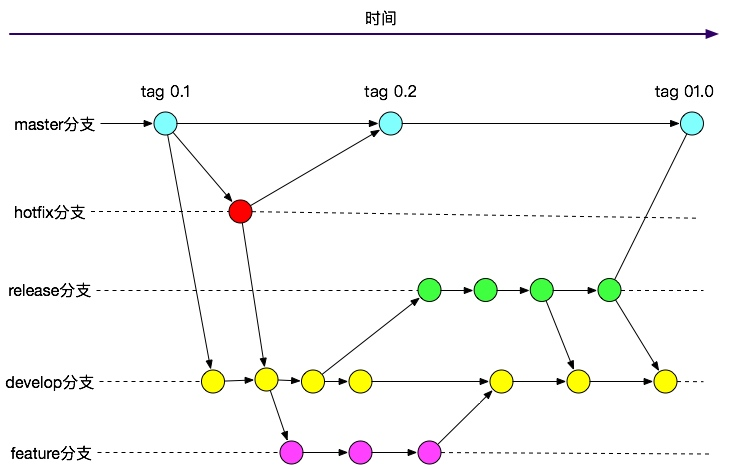

# 工作流简介
由于Git是分布式版本控制系统，虽然带来了很多优势，但是也同时带来了协同工作的复杂性。因此需要一套基于Git的工作流来规范整个协同流程。目前，比较流行的有以下两种：

* Github workflow
+ GitFlow

# Github workflow
Github workflow是基于github一种常用的工作方式，比较简单。流程分为以下几步：

+ 检出新的分支。
+ 在开发分支上完成开发工作，commmit并push到远程库分支中。
+ 向主分支发起pull request
+ 在pull request中发起讨论和修改
+ 将开发分支部署测试环境经测试无误后merge回主分支。
+ 这里最为核心的就是基于pull request的协作方式，在类似于Github这种应用中，还可以基于此来进行code review、任务沟通等工作。

# GitFlow
相比起Github workflow，GitFlow根据Git原来的命令和语义，做了一层语义抽象，多了很多新的定义，从源代码管理角度对通常意义上的软件开发活动进行了约束。流程如下图所示：

说明：GitFlow中定义了两大类分支：  

1. 主分支：主分支是所有开发活动的核心分支。所有的开发活动产生的输出物最终都会反映到主分支的代码中。主分支又分为下面两个分支：

+ master分支：存放的是随时可供在生产环境中部署的代码。当开发活动告一段落，产生了一份新的可供部署的代码时，master分支上的代码会被更新。同时，每一次更新，都添加对应的版本号标签（tag）。
+ develop分支: 保存当前最新开发成果的分支。通常这个分支上的代码也是可进行每日夜间发布的代码。当develop分支上的代码已实现了软件需求说明书中所有的功能，通过了所有的测试后，并且代码已经足够稳定时，就可以将所有的开发成果合并回master分支了。

2. 辅助分支：用于组织解决特定问题的各种软件开发活动的分支。辅助分支主要用于组织软件新功能的并行开发、简化新功能开发代码的跟踪、辅助完成版本发布工作以及对生产代码的缺陷进行紧急修复工作。这些分支与主分支不同，通常只会在有限的时间范围内存在。也可以视作临时分支。
辅助分支又分为：

+ feature分支：用于开发新功能时所使用的分支。从develop分支发起feature分支，代码必须合并回develop分支。此分支甚至可以仅仅保存在开发者自己的代码库里而不提交。
+ release分支：用于辅助版本发布的分支。从develop分支派生。必须合并回develop分支和master分支。此分支为发布新的产品版本而设计的，当develop上开发的功能基本成型可以发布的时候就可以派生出release版本。在这个分支上的代码允许做小的缺陷修正、准备发布版本所需的各项说明信息，如：版本号、发布时间、编译时间等等。
+ hotfix分支：用于修正生产代码中的缺陷的分支。从master分支派生且必须合并回master分支和develop分支。此分支一般是计划外的分支，但最终输出和release分支类似，都可以产生一个新的可供在生产环境部署的软件版本。当生产环境遇到了异常情况或者需要紧急修复的bug时，就可以从master分支上指定的tag版本派生hotfix分支来组织代码的紧急修复工作。

为了简化使用GitFlow模型时Git指令的复杂性，GitFlow的作者开发出了一套Git增强指令集。可以运行于Windows、Linux、Unix和Mac操作系统之下。地址见：https://github.com/nvie/gitflow。

# 注意
+ .gitignore中添加不需要版本管理的文件，如：.DS_Store、logs、target、node_modules等。根据工程的类型不同这里需要加入的文件也不同。
+ git push之前需要先git pull更新代码
+ 如果想要忽略已经在版本库里的文件/文件夹，即有一个版本库里的文件你做了改动但并不想被提交版本库中。这时可以使用命令git update-index --assume-unchanged <file>，之后可以通过git update-index -—no-assume-unchanged <file>恢复跟踪。通过git ls-files -v | grep -e "^[hsmrck]"可以列出当前被忽略的、已经纳入版本库管理的文件。
+ 使用git cherry-pick <commit id>可以选择某一个分支中的一个或几个commit(s)来进行操作。
+ 永远不要所有人都在的公共开发分支上做rebase操作。一般情况下在临时分支上是需要rebase主分支代码的，而merge则主要用在主分支上将临时分支的代码合并过来，然后就可以删除临时分支了。