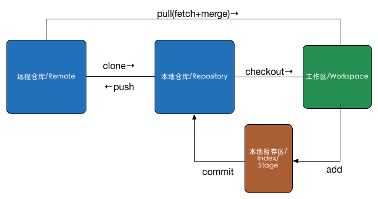

# 简介
Git是一个分布式版本控制系统，相比起SVN的集中式版本控制，每个工作计算机都可以做为版本库，可以不依赖远程仓库服务器离线工作。此外，它的每一个版本库都保存了完整信息，且是按照元数据的方式存储的。

# 流程



# 常用的几个命令

1. 克隆项目的Git地址
```
git clone [repository url]
```
+ 切换项目分支
```
git checkout [branchName]
```
+ 增加或改动了一些文件
```
git add [fileName]
```
这里也可以使用 git add --a 添加所有变动到暂存区

+ 提交文件到本地库
```
git commit -m [message]
```
可以使用 git commit -a 跳过git add步骤直接commit。

+ 提交到远程库
```
git push origin master
```
+ 从远程库更新代码并合并
```
git pull
```
此命令是 git fetch 和 git merge 的结合。

+ 合并不相关的分支
```
git merge [third_repository]/master  --allow-unrelated-histories
```
这样即能够合并两个Git项目为一个且保留两个项目的历史记录。其中，third_repository为要合并的项目的远程仓库名称，需要先使用git remote add third_repository [third_repository_url]添加为当前项目的远程仓库，并git fetch third_repository；--allow-unrelated-histories参数则是允许合并不相关的历史记录。

+ 使用Git官方的服务器作为中央版本库，还是使用Github这种，本地库与远程库交互的一种方式就是通过公私钥来进行的.
```
ssh-keygen -t rsa -C [userName]
```
然后按照提示输入相应信息生成成功后，把公钥放置到服务器上即可。