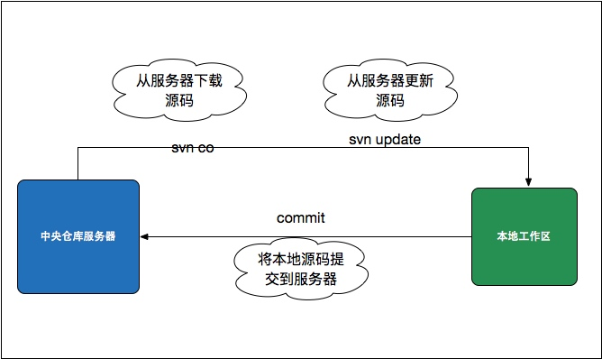

# 简介
SVN是前几年用的最为普遍的一个VCS工具，采用了分支管理系统。具有以下几个特点：

+ 原子提交。一次提交不管是单个还是多个文件，都是作为一个整体提交的。在这当中发生的意外例如传输中断，不会引起数据库的不完整和数据损坏。
+ 重命名、复制、删除文件等动作都保存在版本历史记录当中。对于二进制文件，使用了节省空间的保存方法（只保存和上一版本不同之处）。
+ 目录也有版本历史。整个目录树可以被移动或者复制，操作很简单，而且能够保留全部版本记录。
+ 分支的开销非常小。
+ 优化过的数据库访问，使得一些操作不必访问数据库就可以做到。这样减少了很多不必要的和数据库主机之间的网络流量。
+ 集中式版本控制，依赖于中央版本服务器。

# 流程



#  常用命令

+ 加入一个新项目的开发时，从项目SVN地址获取代码
```
svn co [svn_url]
```

+ 把改变的文件添加到版本库中
```
svn add [file]
```
这里可以使用svn add --a可以将所有变动都添加到版本库中。

+ 将改动的文件提交到版本库
```
svn commit -m [LogMessage]
```
+ 更新到某个版本
```
svn update -r [version] [path]
```
svn update如果后面没有目录，默认将当前目录以及子目录下的所有文件都更新到最新版本，如果没有版本号，则更新到最新版本。

+ 查看文件或者目录状态
```
svn status [path]
```
对应于每一个文件有这几个状态：[?：不在svn的控制中；!:被删除；M：内容被修改；C：发生冲突；A：预定加入到版本库；K：被锁定]。

+ 删除文件
```
svn delete path -m “delete test fle“
svn delete [file]
svn ci -m [message]
```
+ 查看日志
```
svn log [path]
```
+ 查看文件详细信息
```
svn info [path]
```
+ 比较差异
```
svn diff [path]
```
这里是将修改的文件与基础版本比较

+ 恢复本地修改
```
svn revert [path]
```
恢复原始未改变的工作副本文件（恢复大部份的本地修改）,需要注意的是此命令不会恢复被删除的目录.

+ 代码库URL变更
```
svn switch [svn_url]
```
switch仅限于同一个repository下的目录之间，switch并不关心切换的目标分支与源分支之间的关系。switch的代价很小，因此应尽量使用switch，而不是完整的check out。

+ 解决冲突
```
svn resolved [PATH]
```
移除工作副本的目录或文件的“冲突”状态。这里只是移除冲突的相关文件，然后让 PATH 可以再次提交。


# 服务器搭建
SVN是集中式版本控制系统，依赖于中央版本服务器的。Windows下使用VisualSVN Server即可；Linux下通过官网的源码包编译安装即可。

# 注意
1. 应尽量避免的操作：
+ 格式化代码，完全改变文件的行号缩进等。
+ 直接用另一个版本的文件覆盖当前文件。
+ 在Windows下更改文件名，但只改了文件名的大小写。
2. 保证提交的完整性: 零碎提交功能不完整的代码将引起协同开发的同事以及QA运行代码的困难，且不利于版本的回退等操作。
3. 不应提交的文件：以’.’开头的文件、目录，例如.classpath、缩略图文件、class文件。
4. 提交代码前务必先svn update。