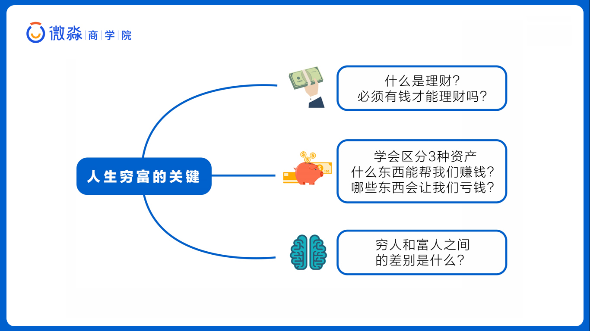
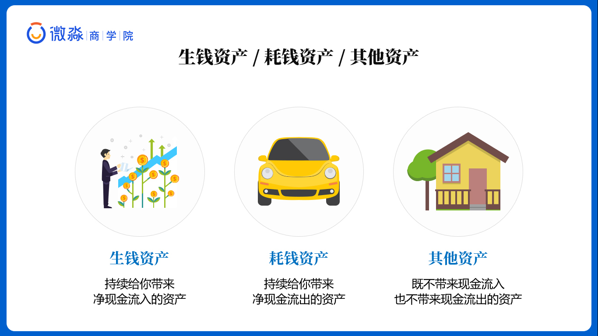
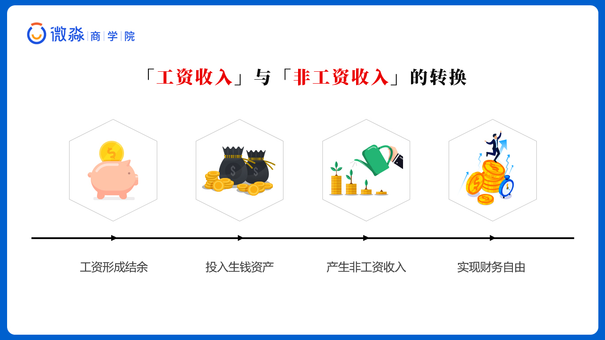
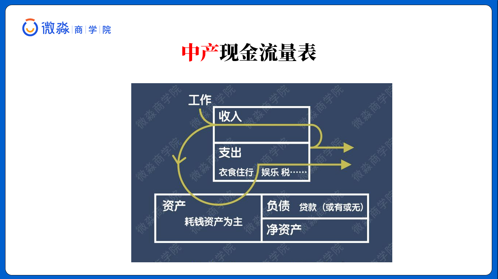
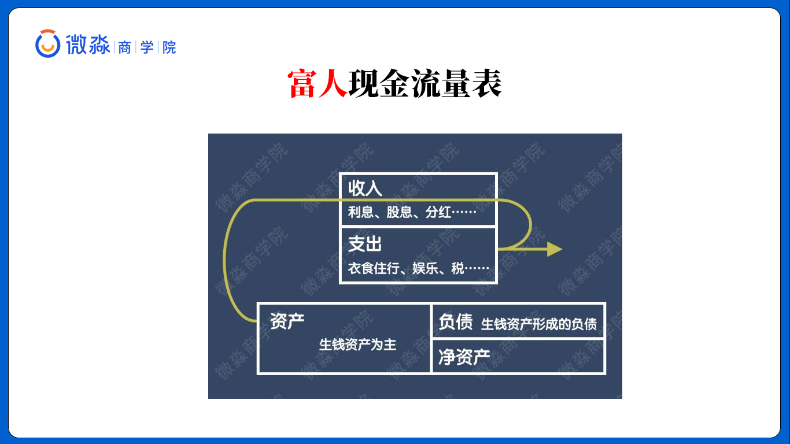
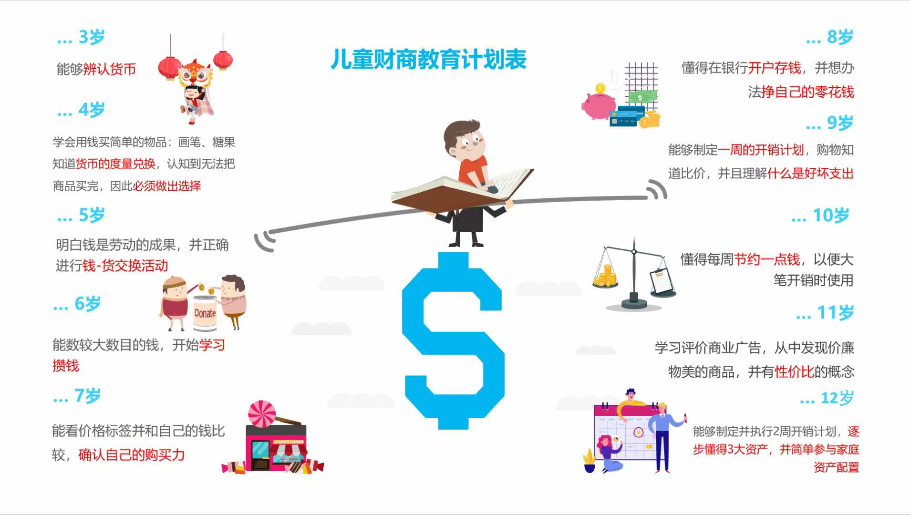
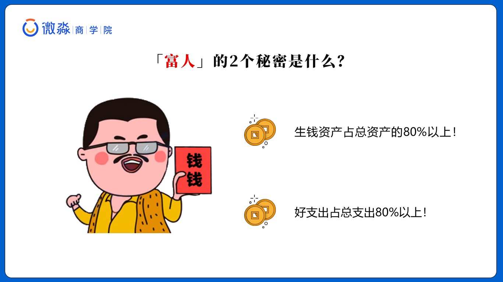
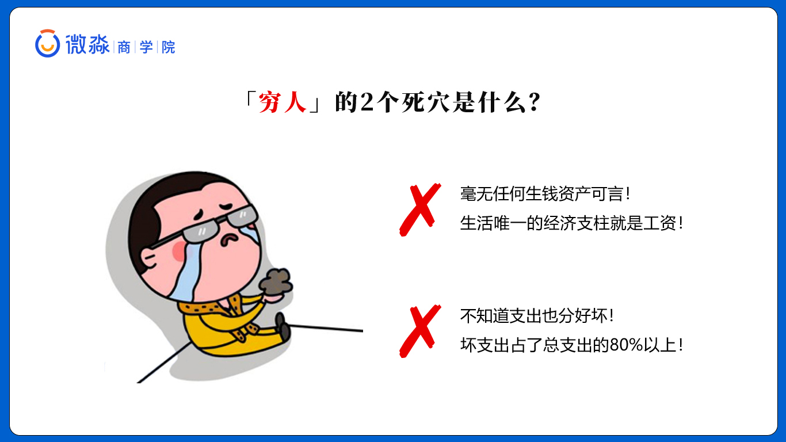
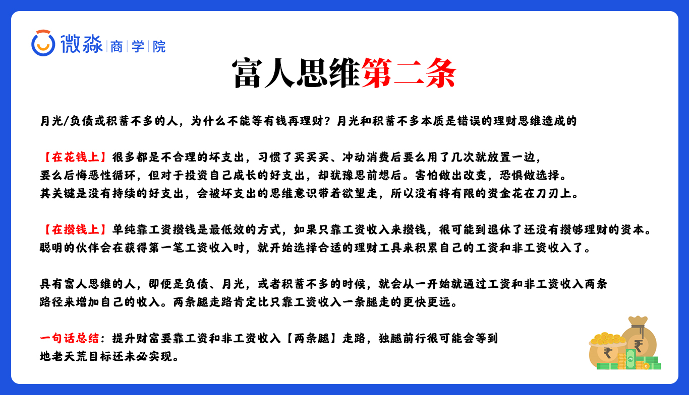
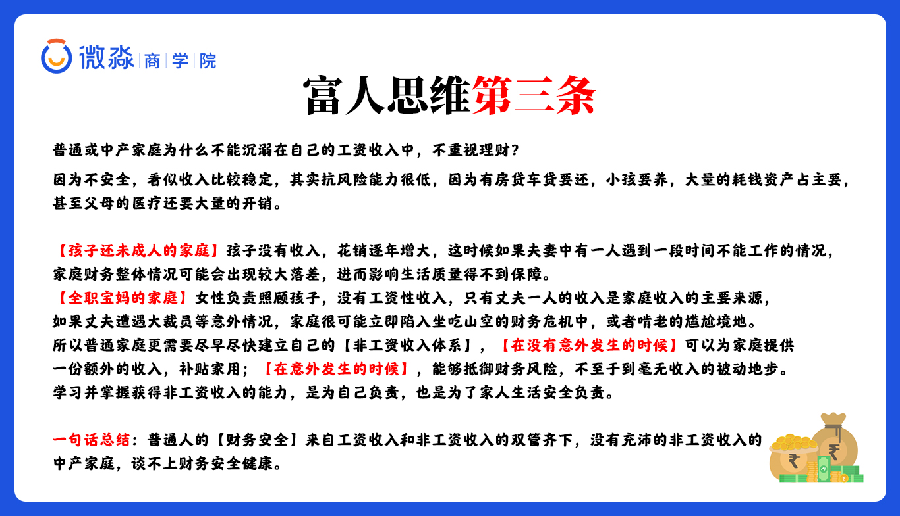

# 早读思维之学习理财，遇见未来不一样的自己

只要学会理财，怎样用钱生钱，才能过更富有。


# 午间防骗之股票投资骗局

自己必须要足够得理财知识，才能正确得理解股票，不要听信与别人在怎么怎么的。

# 晚间分享之人生穷富的关键





1、什么是理财？必须有钱才能理财吗？
2、学会区分3 大资产，到底什么东西能帮我们赚钱？哪些东西会让我们亏钱？
3、穷人和富人之间的差别是什么？


## 什么是理财？

投资≠理财，投资只是理财的一部分，理财是一个很广泛的概念：


可以说，**凡是涉及跟钱有关的安排，都是【理财】**

只要你花钱，其实就已经在理财了，记住，**投资只是理财的一部分**

同样一笔钱，你如何使用，这就是理财。不同的处理方式会产生皆然不同的结果，这也是我们学习理财的意义和价值


## 什么是资产

简单的说资产就是一切可以用货币计量的东西。

```
举例：房子、车子、票子、桌子、椅子、手机、电脑、锅、碗、瓢、勺、股票、基金等都是资产
```

会计上把资产划分为流动资产和非流动性资产。但是，这对于投资理财却没有用

既然大家入门开始学理财了，首先要学会用三大资产来划分：生钱 、 耗钱 和 其他资产


### 资产真正的内涵

**重点，资产真正的内涵是【现金流】**

简单说钱流动的方向就是【现金流】

资产让钱往兜里流就会富有，往外流就会变穷，所以是【现金流的方向】决定了【资产的类型】。


### 三大资产

基于资产产生【现金流方向】的不同，可以把资产分成 3 种。

#### 1. 生钱资产

持有期间能给你【持续】带来净现金【流入】的东西。

```
这里我们可以想一下，假设你拥有的这个资产，一直让钱往你兜里流，你肯定很喜欢，也会越来越富有。有了生钱资产，你就可以躺着数钱了，这就是所谓的【睡后收入】
```

这里强调一下**【持续】**很重要，持续指每个月、每个季度或每年能不断的给你带来【净现金流入】,如果持有期间没有【持续】的给你带来净现金【流入】，当你卖的时候才能获得价差收益，那就不是生钱资产

```
比如：10年前自住使用，买了8000一平的房子，10年后涨到50000一平卖了，这【不叫生钱资产】
原因：
因为买卖的价差收入是【一次性】的收入，而不是【持续】的现金流入
除非你把这个房子出租出去，每个月获得的租金能覆盖房贷、物业费，这才是你躺着就有的收入，这才是【生钱资产】
```

生钱资产的价格短期内确实也会下跌，但不同的是，生钱资产即使价格下跌了，生钱资产依然会为你带来【持续】的净现金流入。

生钱资产的特点决定了生钱资产是一种**无论价格涨跌都能赚钱**的资产

那么问题来了

拥有这样的资产，你想不富都难。现在同学们知道为什么有的人会越来越富有了吧？因为它生钱资产多呀

#### 2. 耗钱资产

持有期间能给你【持续】带来净现金【流出】的东西。

```
有了耗钱资产，你躺着的时候还在付钱，这就是所谓的【睡后支出】
```


由于耗钱资产持续不断的带来净现金流出，持有耗钱资产的人只有在一种情况下能赚钱：

- 那就是卖出价格大幅高于买入价格时（价差收益还需要覆盖持有期间的净现金流出）


耗钱资产的持有损失是确定的，未来价差收益是不确定的，所以风险就很大。而有一些耗钱资产，未来价格也是确定会比买入价格低的，那亏损就更大了，比如私家车

**既然【耗钱资产】这么不好，那么我们要不要持有耗钱资产呢？**


#### 3. 其他资产

【其他资产】在你持有期间不能给你产生任何收益，只能在未来卖掉它的时候赚到不确定性的收益（也有可能亏钱）。




学完这个概念之后，大家可以再好好体会一下这句话，会有新的体会：有钱不一定富有，富有却一定很有钱。

**如何选择出【优质的生钱资产】才是关键，我们一定要先把概念理解透彻。**

到底是什么决定了人生的穷富？人生穷富的关键是什么？

穷人之所以穷，富人之所以富的关键就在这两个字：**资产**


### 工资收入和非工资收入

- **工资收入**

就是自己付出时间、精力、汗水挣来的钱。

像我们大部分人都是拿工资的，你必须去上班才有收入，这种就是工资收入。

- **非工资收入**

就是，你不需要去劳动，也能有收入。

```
就像有人说的：躺着就把钱赚了或者不干活也有钱，比如利息、股息、分红、版税、专利等收入啦
```


#### 那么如何才能拥有非工资收入呢？



```
工资形成结余 → 用结余去换成生钱资产 → 生钱资产产生非工资收入 →非工资收入帮助我们实现财务自由。
```

具有富人思维的人即便是负债、月光，或者积蓄不多的时候，也会从一开始就通过【工资】和【非工资】收入【两条路径】来增加自己的财富

#### 结论

所以昂，我们应该两手抓，两手都要硬，两条腿走路，【工资收入】和【非工资收入】都要有.两条腿走路肯定比只靠工资收入一条腿走的更快更远！


**【非工资收入】才是自己实现财富目标的起点**


##  穷人和富人的区别

#### 1. 普通人或者说中产阶级的现金流



- 中产的资产中主要是耗钱资产，以房子、车子为主
- 中产可能有贷款也可能没有贷款
- 中产的收入主要来自工资收入
- 中产把工资收入变成了耗钱资产，耗钱资产不停消耗中产的钱。

为了养耗钱资产，中产是不能停止工作的。由于耗钱资产的存在，中产几乎是很难变富有的。

**看似体面有房有车的中产，资产的实质结构【抗意外风险系数】是极低的。**

#### 2. 富人的现金流



- 富人的收入主要来自【生钱资产】！
-  生钱资产产生的现金流入完全能够覆盖各种支出。
- ️富人不用为了生活而去工作！


**一定要谨记，早一点开始理财，早一点提高家庭抗风险系数，是对自己和家人都是最好负责任的表现**


### 儿童财商教育计划表

更高财商的表现，还会从孩子会用钱的那一天起，就教会孩子如何去支配钱，使用钱




### 那想成为富人要怎么做呢？

1. 生钱资产占总资产的80%以上；
2. 好支出占总支出的80%以上。




### 穷人的两个死穴

1. 毫无任何生钱资产可言！生活唯一的经济支柱就是工资！
2. 不知道支出也分好坏！坏支出占了总支出的80%以上。




## 思考

**1. 黄金属于什么资产**

属于其他资产，文物和收藏也是其他资产

买入其他资产，其实就是【投机行为】，我们要杜绝投机


**2. 银行存钱，是什么资产**
这种情况它是【生钱资产】
但是属于很劣质的生钱资产，因为收益率低，是远远跑不过现在的通胀率的

```
例如：ZFB的理财产品，WX理财产品，银行的保本型理财产品等等
```

 

**3. 生钱资产为什么叫【睡后收入】？**

因为你睡着之后你的生钱资产还在为你赚钱，生钱资产和人的区别是生钱资产可以每天工作 24 小时，全年无休的为你赚钱，并且它还感觉不到累


**4. 什么是财务自由？**

生钱资产产生的【非工资收入】大于【日常总支出】

```
比如：你日常支出是 1 万元，那么只要你的生钱资产每个月能帮你创造 1 万元以上的收入，那你就已经财务自由了
只要你持有生钱资产到一定的数量，财务自由是一种必然
因为你每持有一点点【生钱资产】，生钱资产就会给你创造一点点【非工资收入】
同样如果你想变穷，只需不断的买入耗钱资产就可以了

```


**5. 如何理财才能让自己变富呢？**

答：先培养自己对理财的正确认知，再了解各种理财工具，然后再进一步学习如何正确姿势去投资，之后再去完善好家庭的生钱资产配置，一步步的提升自己，就能理好财变富了。


**6. 房子是什么资产？**

1. 假如你有一套房子，没有贷款租出去获得了租金，给你带来了现金流，它就是生钱资产；或者说有贷款，但租金能够覆盖每个月的月供和物业费并有结余，那它也是生钱资产。

2. 相反，如果是三成首付买的房子自住，不但没有租金收入，每个月还要支付大笔月供以及相应的物业费，那么它就是耗钱资产。

当然即使没有贷款的房子，自己住的这段时间里你还需要为房子付物业费、保险费，产生持续的现金流出，所以没有贷款的自住房也是耗钱资产。

3. 那么如果是三成首付买的房子投资，出租出去，租金刚好覆盖月供、物业费各种支出，那这时它就是其他资产。

厉害吧，同样是房子原来可以是3种不同的资产啊。以后大家再看房子一定不能只看长相了，更要看内涵。要看它产生的净现金流。不然遇到了渣房，就只能在厕所里默默的流泪。真的，当你买了一套渣房之后，你就会被耗钱资产的房子套牢，想脱身都难。

```
同样，股票、基金等理财工具，也是可以成为你的【生钱资产】或者【其他资产】
```

**7. 私家车是什么资产呢？**

1. 私家车是自用的，每年都有保险费、保养费、停车费等支出，私家车持续的带来净现金流出，所以私家车是耗钱资产。
2. 如果用这个车在业余的时候跑个顺风车，收入能覆盖掉自己的日常用车，还有结余，那么是什么资产呢？还是耗钱资产。因为开私家车拉活赚的钱需要你投资大量时间，这其实是你的劳动收入。而不是由车本身带来的净现金流入，如果你不拉活，就没有这笔收入。所以私家车还是耗钱资产。
3. 有一种情况，你把车通过某个租车平台出租出去了，租金去掉各项支出后还有净现金流入，这种情况下私家车才是生钱资产。不过既然是私家车，一般也不会出租的。所以私家车是耗钱资产。

## 深入的理解

**生钱资产就是给你不断带来净现金流入，就像鹅下金蛋一样，**只要鹅在，就会不停下金蛋，下的蛋换成饲料给鹅，那么鹅就会越来越肥，下更多的蛋等存了更多的金蛋以后，还可以买更多能下金蛋的鹅。

**耗钱资产就是让你不断花钱支出的东西，**可以看作公鹅，只吃饲料不下蛋。


## 总结

要想增加自己的非工资收入，核心方法就是增加自己的【生钱资产】，这是必经之路.

我们判断一种资产是什么类型的资产，是看这种资产带来的【现金流方向】！记住，现金流方向



