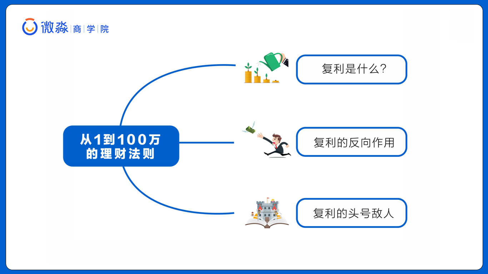
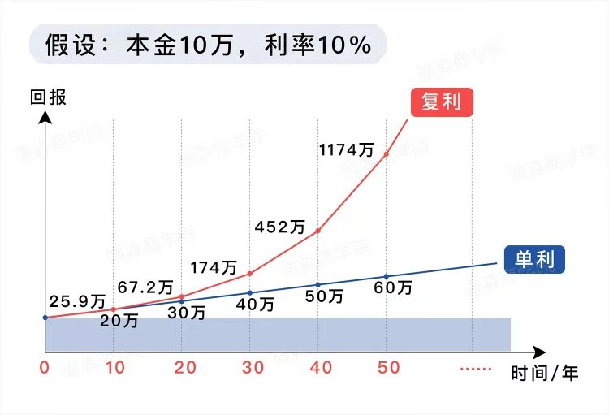
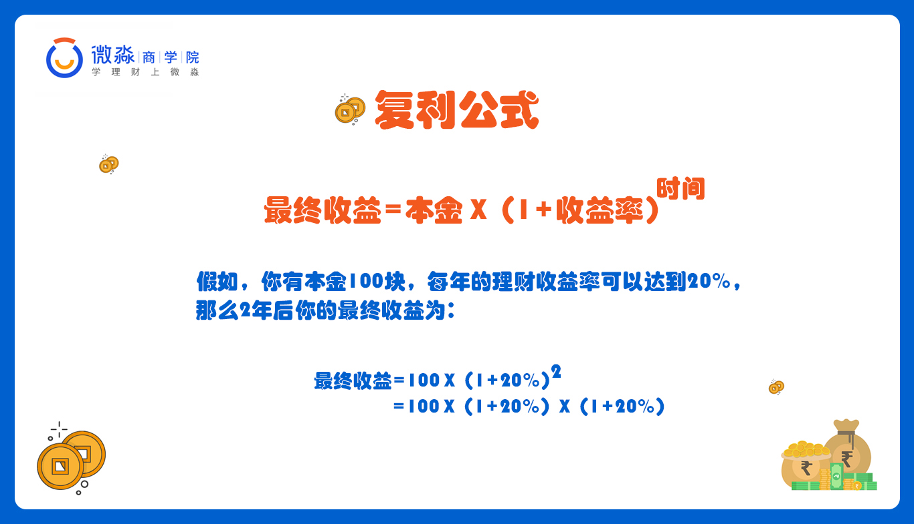
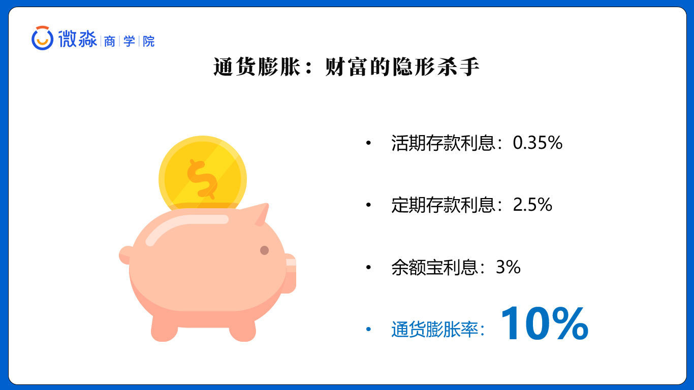
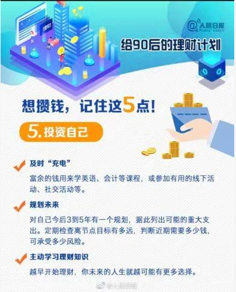
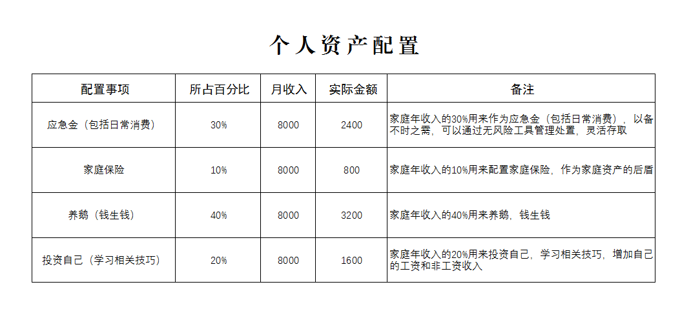
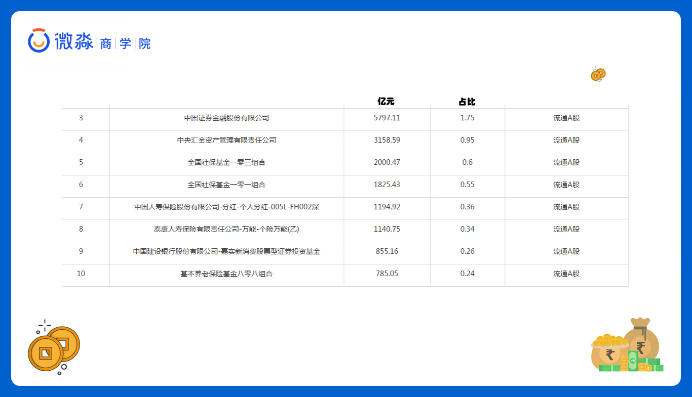
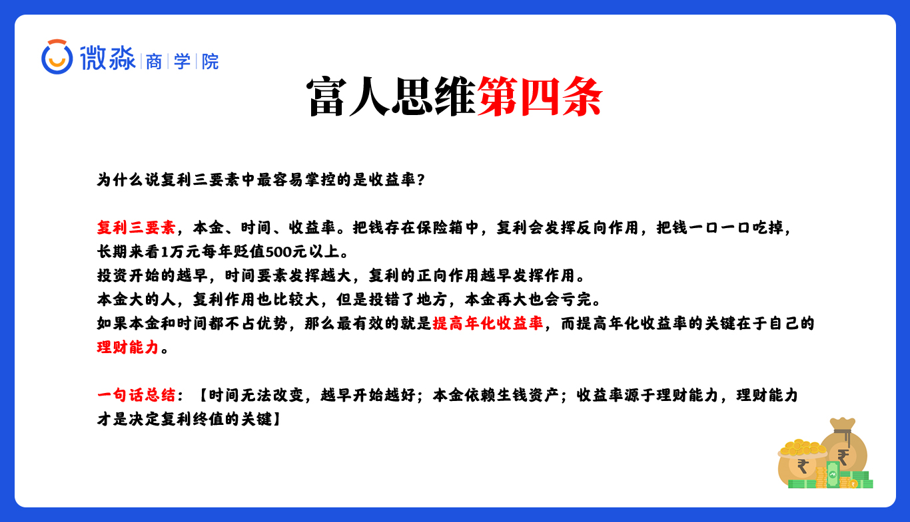
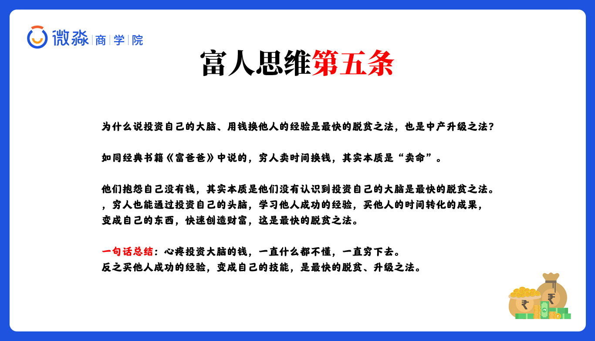

# 早读思维之如何从穷人思维过渡到富人思维？

凡事都是思维先行，技巧其后。做事情之前都要进行思考，然而量化（包含时间  金钱等等）则是思考的重点，也是自己抉择的重点，我们在日长生活中，往往会忽略时间成本，然而时间才是我们最大的财富，把时间拿起去学习，丰富大脑，才会越来越富有，学习就是用自己的 时间换取别人用生命（时间）换来的东西。学会量化时间，把时间用来做更有用的事情。

【量化思维】：大家在考虑价值的时候要加上【时间成本】 、【机会成本】和【试错成本】，不要单一的只看价格

「穷人思维」会让自己为了省一点钱而花费大量的时间和试错的代价。

富人思维」则会把时间花在更有价值的地方，愿意用钱去换更成功人的时间和经验。

# 午课防骗之p2p骗局

P2P骗局，容易崩盘

**避免p2p最好的骗局就是远离p2p**

你盯着别人的利息，别人盯着你的本金。

# 晚间分享之从1到100万的理财法则



何事都不能单单凭感觉，我们投资也是一样，一定要有数据做为支撑


巴菲特的合伙人查理芒格也说过：“投资的灵魂有两部分：

1. 理解复利的魔力。
2. 获得复利的能力”

[理财计算器](https://oss-class.weimiaocaishang.com/Site/calculator.html)

```
在里面输入，金额：24 ，收益率：7%，时间：374 
```


## 1、复利是什么？

在经济学里，复利是一种计算利息的方式！
【复利】是区别于【单利】而言的！

通货膨胀就是复利形式的，过去二十年通胀率大约是10%，后面会带大家计算这个通胀率



### 复利的公式

复利的公式是：最终收益=本金X（1+收益率）^时间




根据复利公式，我们知道影响复利最终收益的因素有：**【收益率，时间，本金】**

- 第一个因素是本金，本金越多，最终收益越大。

但是本金的影响其实没有那么大，最重要的是本金在短期内是【很难改变的】！

- 第二个重点要素：时间

- 最重要的第三个要素：收益率

收益率影响非常大，年化5%和年化10%，差别是显而易见的

10000本金   不同的收益率    时间30年

收益率  5%       10%      15%
收益     43万    174万  662万

### 怎么才叫利用好呢？

第一就是不能亏损，第二就是要高效的生钱

## 2、复利的反向作用

反向的影响就是：【通货膨胀】
我们货币的购买力一直在被通胀吞噬着，还是用最典型的例子来说明





## 3、复利的头号敌人


同时也是今天的第三个重点复利的头号敌人是：亏损

## 思考

1. **复利三大因素中哪一个最【重要】，对最终【结果】影响最大，同时也是我们能通过学习理财技能来提升的**？

答：收益率

2. **那大家觉得什么决定了收益率？再或者怎么才可以获得高收益率呢？**

   答案：支撑收益率的内在核心是⭐【理财能力】，或者【理财技能】⭐

3. 我来说一下，为什么说复利三要素中最容易掌控的是收益率？

   本金：并非决定性的要素，而且短期内难以改变

   时间：我们没办法控制时间，也无法回到过去，但是我们可以尽早开始复利，越早开始收益越大

   收益率：如果本金和时间都不占优势，那么最有效的就是提高收益率，而提高收益率的关键在于自己的理财能力。这是我们可以通过学习提升的，也是三者中是最容易掌控去改变的

## 总结

普通人唯一可复制的致富渠道，就是善用复利的力量，通过【合理的技能】【科学的赚钱】，这是确定性的，可以帮助你变得富有的方式！！


再次强调：不要做那种看见了都不相信的人dui

富人思维：有半瓶水
穷人思维：空了半瓶水
杠精思维：你有什么证据证明这些液体是水


贫穷的原因很大一部分是因为【懒】不是【身体懒】而是【思维懒】


穷人抱怨自己没钱，其实本质是没有认识到【投资自己的大脑】是【最快的脱贫】之法。

【增值财富的本质，一定是增值自己的认知】

人永远无法赚到自己认知以外的钱




有几种钱是越花越有的！

1.孝敬父母的钱
2.投资自己学习的钱
3.请良师益友吃饭的钱
4.做慈善的钱


第一，想变富有，不建议依赖第三方（比如支付宝）的基金

比如：余额宝就是货币基金，那是场外基金，手续费高，不能实时成交，支付宝是第三方代理平台，代理为的是方便大家直接购买，因为大家没有好的理财技能


场外基金，说白了就是，他代理了这个基金。卖给你，他拿点手续费，你挣点钱


第二件事，理财经理推荐的理财产品不懂时候也不要乱买

大堂经理推荐的是主动基金。可能她也不知道他推荐的基金到底好不好，手续费还相对较高

第三件事，理财型保险，不懂时候也不要乱买

别问为什么，一问就会有保险行业从业人员出来怼我，但我只站在为大家好的立场发表意见


国家有正规的证券交易平台，我们可以在那上面买。当然，前提是自己掌握理财技能之后。



家可以看到，社保和保险的钱都在股市里



