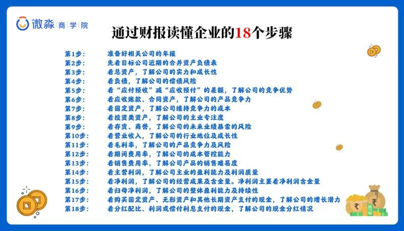

# 早读思维之
**怎样越花越有钱**
把钱花到买优质资产的地方，把钱花到能够节约更多时间的地方，把钱花到能创造财富的地方。

# 午课防骗
**荐股+高杠杆非法平台骗局**
如果盲目的相信别人推荐的股票，自己没有一个雄厚的理财知识，容易被骗，还有介绍注意一些非法平台。
# 晚间分享
**牛X的财务报表**
## 1、财务报表到底是什么？对我们有什么用？

就好比说，我想看看同学你的经济状况如何如何，于是就有了财务报表，清晰反映出你的财务状况，就像你的财务体检表

通过你的财务体检表，我可以看出来你收入多少？负债多少？资产多少？每年刨除去开支净赚多少？

其实我们在生活中，都在运用财务报表的知识，但是很多同学可能都没意识到

我们投资公司也是，我们得知道，这公司资产规模多大呀？负债多少啊？每年净利润多少啊？收入多少啊？有没有前途等等
答案是财务报表

## 2、财务报表如何指导我们去投资一家企业？

### 资产负债率公式
总负债÷总资产=资产负债率
- 资产负债率大于70%的公司，偿债风险比较大
- 资产负债率小于40%的公司，几乎没有偿债风险
资产负债率越高，风险越高，抗风险性也越差

- 【应付】
【先用货，后给钱】，假如海天要产酱油了，但是没有黄豆了，海天先跟黄豆供货商说：你先把豆子给我，然后我晚点儿结账。牛吧！海天不给钱就能把豆子拉走了

-【预收】
【先收钱，后发货】，海天跟产品经销商说：我酱油马上做好了，你先打钱，然后我再给你发货。快打钱，不打钱没货了啊，别人订走了。牛吧，产品经销商先给钱海天后发货
**应付和预收越大越好**
因为在无偿的使用上下游的资金，这虽然是负债科目，但是绝对是好负债，多多益善。这就是我说的，有负债不怕，要看负债的结构是什么，【好负债】还是【坏负债】。

- 【应收】
【应该收，但还没收到的钱】海天先发酱油给经销商，但是经销商不给海天钱，说卖完在给钱，谁让经销商卖得好呢。哎，这下海天不牛了

- 【预付】
先给钱，收不到货】海天把黄豆钱都给买黄豆的经销商打过去了，黄豆还没给海天呢，谁让人家黄豆卖的好呢。哎，海天又不牛了
应收和预付越小越好

【应收、预付】，这2个科目大的话，不牛
【应付、预收】，这2个科目大的话，很牛
那我们用【很牛】的这两个科目，减去【不太牛】的这两个科目，得到的结果，就是这个企业到底牛不牛了

如果【竞争力强】，不用担心资金链断裂，也不用担心你公司有缺钱的时候，比如你是海天味业的老板，那么你需要钱的时候就会有人给你【送钱】
如果竞争力不强，市场占有率不高，那你遇到困难，别人怕你还不了钱，信誉不到位啊，谁敢借你钱呢？出现坏账怎么办，这就是【竞争力】啦
竞争力强的公司，投资者去投资，当然比竞争力弱的赚钱概率更大啦

上市公司明显是国内相对竞争力更强的一类

**那这个财报能反映出企业什么情况，他跟企业竞争力有什么关系呢？**
资产的内涵是【现金流】，一个企业的兴衰，本质上也是由现金流决定的，所以很多企业资金链一断就只能宣告破产倒闭了

通过分析造假的常见科目是可以判断财报是否掺有水份

财报中用【应付预收】减去【应收预付】的金额可以判断公司竞争力

## 财报下载地址
上市公司的财报都是公开的，先简单教给大家去哪里下载财报：
下载财报地址是：
巨潮资讯网
http://www.cninfo.com.cn/new/index

具体操作步骤：进入巨潮资讯网—输入公司代码或者名字—查看公告搜索年度报告 - 选择年度报告 -下载或者查看

公司一旦上市，是没有秘密可言的，所有的数据都会公开给投资者，而投资者了解一个上市公司的好坏就是通过【财务报表】

## 看财报有方法
1. 看财报要按步骤看，比结构大小，不是看数字，系统的分析有18个步骤，按步骤来就可以看懂
因为：比结构大小【一目了然】

有图片，18个步骤

只要一家公司符合我们的清单，就可以进行价值投资。有了好的投资清单，财富的积累就是水到渠成

**同时大家也要知道：股票的本质就是企业，买股票就等于买企业**
我这里讲的【竞争力】和【安全性】是可以用来淘汰那些你们蠢蠢欲动要买的自以为好的“坏公司”，但是不是直接用来选股的。因为财报不只这两个指标，选择一家好企业肯定也不止这两个指标
所以大家别盲目贪婪，单纯拿这2个指标去选，小心被割韭菜，还是要谨记我们的投资第一原则！

财务造假是对投资者最大的伤害，没有之一
比如：通过分析造假财报的常见科目，仔细看过财报，就能发现有些公司账上有大量的货币资金，但却借了很多钱，每年还要还很多利息，这就要怀疑货币资金的真实性了。

财报是公司的第一手资料，可以说是一家企业经营状况的【晴雨表】，是最能【如实反映】出一家公司的经营状况和发展状况的，通过财报分析，我们能找出好公司，还能识别财务造假的烂公司
【强调下】财报是用来证伪的，而不是用来证实的。
如果自己是作为理财技能去学习财报，并不难，因为我们是作为投资者去分析财报，只看需要的数据就可以，不是考注册会计师资格证书，因此角度不一样

如果我们找工作的公司没有上市，可以去看同行业上市公司的财报。

## 3、财务报表如何预测我们的财运？如何指导我们配置资产？
☄️富人指“生钱资产”在总资产中的占比【大于】80%的人。
☄️中产指“生钱资产”在总资产中的占比【小于】80%的人。

有无资产，拥有什么类型的资产，决定了一个人最终会成为什么样的人

首先要清楚自己的资产结构，有哪些生钱资产，哪些耗钱资产，哪些其他资产
其次，通过提升自己，掌握合格的理财技能，开始配置越来越多的生钱资产，当生钱资产占比越来越大的时候，自己也就不慌张了，此时也就活出一种财务自由的姿态了

现在大家应该知道了什么样的人在未来一定能实现财务自由吧
就是子孙三代具有【富人思维】和【技能】，都能准确识别生钱资产，并一直维持生钱资产占总资产的比率大于80%的家庭会富过三代

为什么月光和负债的人更应该拿出一部分资金学习理财技能？
【成长有顺序，生活致富也有顺序】——先投资大脑，掌握理财的技能，然后再去生钱，负债不学习只会越来越穷。

## 总结
通过财报看企业，用安全性和竞争力淘汰你手里的坏企业。
中产与富人的关键区别在于是否能够识别生钱、耗钱、其他资产，并科学的持有他们。
无产、中产、富人是可以相互转换的，学好理财技能就能由穷转成中产，由中产转成富人。      