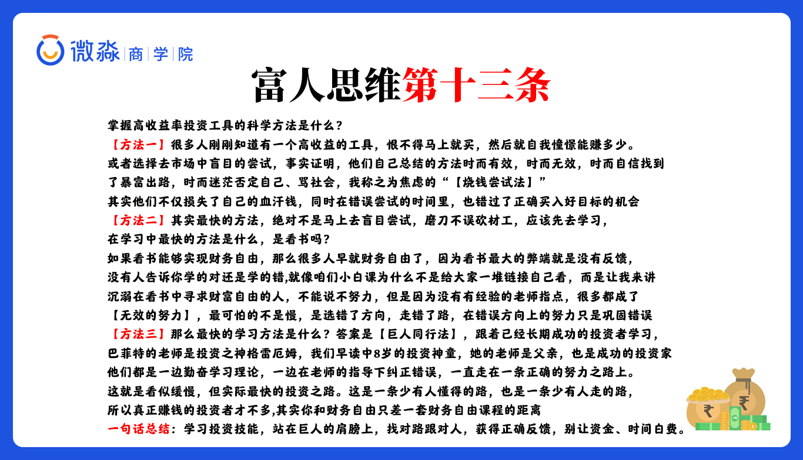

# 早读思维

不要等有时间在做毁了你

一句推脱，后面点在做？有时间才弄？那可能以会一直不做，如果想到了，应该制定计划，一步一步执行，不应该推脱，一味的推脱只会让事情完成不了，或者完成得相当得差。


# 午课防骗

**信用卡融资骗局**

注意信用卡，最好是少用信用卡，如果用得话，最好在正规得地方办理。

# 晚间分享

**指数基金**

## 什么是基金

把投资者得钱集中起来交给基金公司打理，基金公司赚钱了，我们就赚钱了，基金经理会收取手续费。

## 基金有那些类型

基金分类标准不同，名称也不同。

### 按照场地（投资渠道）来分：

- 场内基金：证券交易所内购买的基金（国信，老虎等）

- 场外基金：证券交易所外购买的基金（银行，支付宝，微信等渠道代销的基金，因为是代销，手续费比较高）

  ```
  什么是场?
  指得是证券交易市场，也是我们所说的股票交易市场，证券交易市场不仅可以交易股票，还可以交易在债券，基金，期权等其他有价证券。受国家监管的。通过证券市场交易的就就叫场内交易. 
  ```


### 按照基金的投资标的去划分

- 货币基金

- 债券基金

- 混合基金

- 股票基金

  

  不是绝对值

  ## 按照（投资方式划分）可以分为
  
- 主动型基金：而股票基金、混合基金这些由基金经理主动去选股的基金，就是【主动型基金】

- 被动型基金：并不由基金经理选股，而是按照事先规定好的某种规则进行选股、投资（指数基金（例如标普500））


## 什么是指数基金

它是一种由某种规则编制的，汇集了股市中最好的一些公司构成的基金，优秀的指数基金里选择的都是股市中最好的一群公司，那收益率显而易见

- 恒生指数

由香港股市中最具有代表性的33家公司构成，它可以很大程度上反应香港股市的整体情况

```
从 1964 年成立以来，恒生指数从 100 点到现在 2 万 5 千多点
假如我们从 1964 年投资了恒生指数编制而成的基金，投资 10 万块钱，现在就能变成 2500 万元
```

- 沪深 300

这个指数基金选取了国内上海证券交易所和深圳证券交易所中规模最大、流动性最好的 300 家公司

```
如果你从 2005 年买入沪深 300 指数，无脑买，持有到今天，年化收益率也 10.03%了
```


## 那种基金更加适合投资
### 指数基金（被动型基金）是优于所有主动型基金的，为什么呢**

- 由于是基金经理主动选股，因此都有短期业绩考核，基金经理为了完成短期目标就要被迫进行短期交易。经常进行短期交易的人基本都会被割韭菜，基金也不例外
- 主动型基金有法律强制规定，例如股票基金要求股票资产不能低于资金的80%，也就是说即使你知道现在市场行情非常高估都是泡沫，你可以撤出全部资金不再投资股票，而基金经理只能继续拿钱投资股票，即使他知道这是个泡沫。

所以指数基金有 2 大优势：长生不老、综合长期上涨

#### 长生不老

指数基金是会新陈代谢的，会自动淘汰那些不好的股票，加入满足条件的股票

```
比如说：沪深 300 指数，汇集了规模最大的 300 家企业，但是如果某个企业今年业绩不好，不是前 300 名了，我就把它踢出去，把新的前 300 名加入进来

持仓数×市价就可以算出你持有基金或者股票的总价值
```

#### 长期上涨

由于指数基金编制的是最优秀的一系列股票，股票实际上就是上市企业，而上市企业的发展必定是>GDP 增速的。所以只要国家经济发展 → 企业业绩增长 → 指数基金增长

```
只要挑选合适的指数基金买入即可，不需要选股看盘，省时省力，而且指数基金每年都有分红又能享受复利，强收益，简直就是理财小白的投资神器。
掌握理财技能方法之后定投指数基金，低估时买入，估值合理时持仓观望，高估时卖出，这样就可以获得高收益
```


## 如何定投指数基金

定投：简单理解就是定期每个月投入资金买入指数基金

指数基金也有两种投资方式


【定投期】可以是每月、每季度、每年

光定投也不好，最好我们是【定期】+【变额】

就是每个月固定时间投资，但是每个月投资的金额不同,盈率现在被低估，我就多投点，市盈率现在被高估我就少投点.

**【变额】怎么变呢？**

这个变化不是随意变的，而是跟随投资工具的市盈率而变,例如：

- 市盈率小于15时，每个月定投金额为X元
-  - 市盈率小于12时，每个月定投金额为2X元
- 市盈率小于10时，每个月定投金额为4X元

**什么是市盈率呢？**

市盈率：专业说法是市价盈利比率，是一个投资回报指标

```
比如有个公司，每年盈利 10 块钱，而它的市值是 200 块钱，这样盈利下去，需要20年回本，10块X20年=200市值
```

这个数字 20，就是代表这个公司市盈率是 20 倍，代表公司 20 年回本

注意：市盈率在 30 或者 10 都是不太合理的

市场悲观的时候，市盈率可能会低到 10 以下

作为理性投资者我们要做的就是在市场悲观的时候买入,在市场情绪极度乐观的时候，卖出就可以了

因为市盈率是一个投资回报率的参考指标，太高或太低都是不合理的


