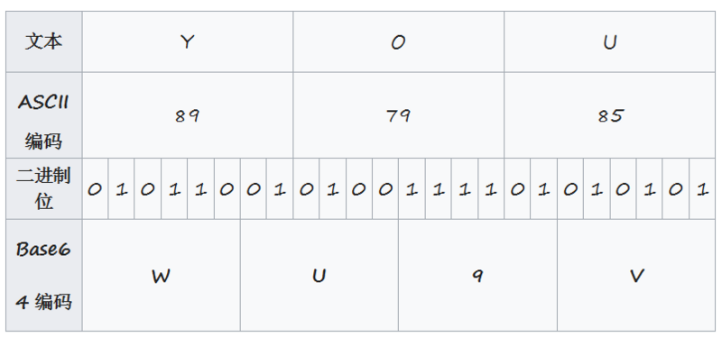
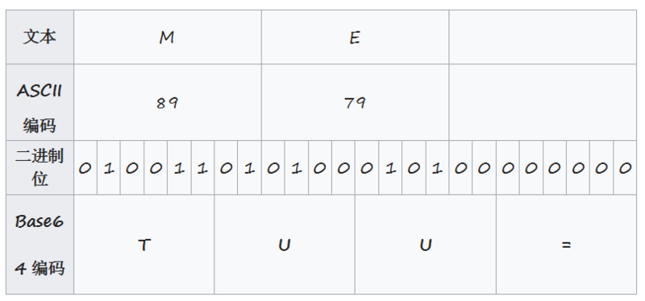

# 简介
Base64 是基于 64 个可打印字符 A-Z、a-z、0-9、+、/ 来表示二进制数据的表示方法，常用于数据在网络中的传输。

按照RFC2045的定义，Base64被定义为：Base64内容传送编码被设计用来把任意序列的8位字节描述为一种不易被人直接识别的形式。


# Base64 编码
Base64 本质是一种将二进制转为文本的方案。基本规则如下：

> - 编码时候选用 64 (大小写英文字母，数字，+ /)个字符以及用作补位的=来表示.
> - 在编码的时候，将3个字节变为4个字节，4个字节的高两位都用 00 来填充，后 6 位来表示 64 个字符。

## 以一个实际的例子 "YOU" 为例



由上表格可知 "YOU"对应的 Base64 编码为："WU9V"。

对于要待编码的字符数如果不是 3 的倍数时候，会用 0 去填充，编码出来后用 = 号表示，如： "ME" 其编码如下：



# Base64 解码
将 4 个字节变为 3 个字节；

- 将 24 bit 左移 16 位，与 255 进行与操作，获得第一个字符，
- 将 24 bit 左移 8 位，与 255 进行与操作，获得第二个字符，
- 将 24 bit 与 255 进行与操作，获取第三个字符


# Base64使用场景
- 对不支持二进制传输的场景， 将二进制数据编码成 - - Base64 传输给服务器
- Base64 编码图片
- MIME, 电子邮件系统中使用 Base64 编码后传输


# Java中使用
在Java中提供的base64的实现，在包`java.util`下，下面演示使用方法。
```
String content = "YOU";
		
String encoderCntent = Base64.getEncoder().encodeToString(content.getBytes());
System.out.println(encoderCntent); //WU9V

byte[] b = Base64.getDecoder().decode(encoderCntent);

System.out.println(new String(b)); //you

```

