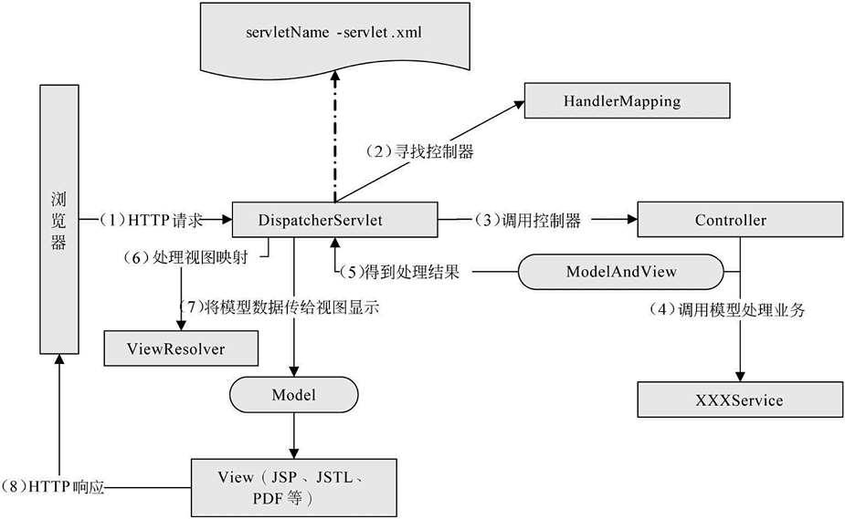

# 简介

Spring MVC框架是高度可配置的，包含多种视图技术，例如  技术、Velocity、Tiles、iText 和 POI。
MVC 框架并不关心使用的视图技术，也不会强迫开发者只使用 JSP 技术，但教程中使用的视图是 JSP，本节主要介绍 Spring MVC 框架处理用户请求的完整流程和处理中包含的 4 个接口。Spring MVC 框架主要由 Dispatcher、处理器映射、控制器、视图解析器、视图组成。

 # 工作原理

1. 客户端请求提交到 DispatcherServlet。
2. 由 DispatcherServlet 控制器寻找一个或多个 HandlerMapping，找到处理请求的 Controller。
3. DispatcherServlet 将请求提交到 Controller。
4. Controller 调用业务逻辑处理后返回 ModelAndView。
5. DispatcherServlet 寻找一个或多个 ViewResolver 视图解析器，找到 ModelAndView 指定的视图。
6. 视图负责将结果显示到客户端。

## Spring MVC的几个接口

## DispatcherServlet
Spring MVC 所有的请求都经过 DispatcherServlet 来统一分发，在 DispatcherServlet 将请求分发给 Controller 之前需要借助 Spring MVC 提供的 HandlerMapping 定位到具体的 Controller。

## HandlerMapping
从HandlerMapping中匹配此次请求信息的Handler,匹配条件：请求路径，请求方法，header信息等。有下面几个常用的几个Handler Mapping。
- SimpleUrlHandlerMapping:简介映射一个URL到一个Handler上。
- RequestMappingHandlerMapping:扫描RequestMapping注解，根据相关配置，绑定到URL到一个Handler（Controller）。
## Handler
获取对应的Handler(Controller,控制器)，这里有一个关键组件HandlerAdapter，是Controller的适配器，SpringMVC最终通过HandlerAdapter来调用实际的Controller方法，下面是两个常用的适配器：
- SimpleControllerHandlerAdapter:处理实现了Controller接口的Controller。
- RequestMappingHandlerAdapter:处理类型为HandlerMethod的Handler,这里使用RequestMapping注解的Controller的方法就是一种HandlerMethod。

Controller 接口将处理用户请求，这和  Servlet 扮演的角色是一致的。一旦 Controller 处理完用户请求，将返回 ModelAndView 对象给 DispatcherServlet 前端控制器，ModelAndView 中包含了模型（Model）和视图（View）。
## ViewResolver。
ViewResolver 接口（视图解析器）在 Web 应用中负责查找 View 对象，从而将相应结果渲染给客户。