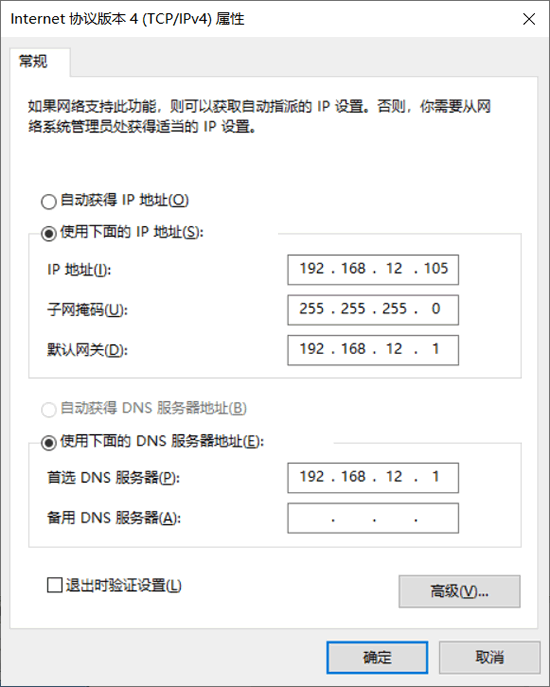
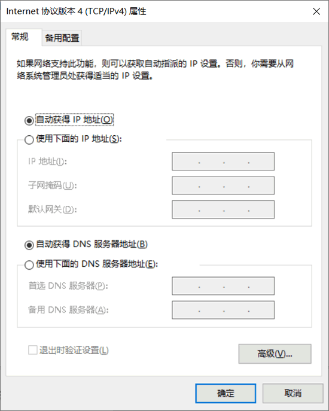

# 简介

IP 地址（Internet Protocol Address）是互联网协议特有的一种地址，它是 IP 协议提供的一种统一的地址格式。IP 地址为互联网上的每一个网络和每一台主机分配一个逻辑地址，以此来屏蔽物理地址的差异。


那么，我们为什么要使用 IP 地址呢？

在单个局域网网段中，计算机与计算机之间可以使用网络访问层提供的 MAC 地址进行通信。如果在路由式网络中，计算机之间进行通信就不能利用 MAC 地址实现数据传输了：因为 MAC 地址不能跨路由接口运行；即使强行实现跨越，使用 MAC 地址传输数据也是非常麻烦的。

这是由于内置在网卡里的固定 MAC 地址不能在地址空间上引入逻辑结构，使其无法具备真正的地址来表示国家、省、市、区、街道、路、号这类层次。因此，要进行数据传输，必须使用一种逻辑化、层次化的寻址方案对网络进行组织，这就是 IP 地址。


## IP地址的基本构成

为了便于寻址，了解目标主机的位置，每个 IP 地址包括两个标识码（ID），即网络 ID 和主机 ID。同一个物理网络上的所有主机都使用同一个网络 ID，网络上的一个主机（包括网络上的工作站、服务器和路由器等）有一个主机 ID 与其对应。

网络 ID 和主机 ID 含义如下：

- 网络 ID：用于识别主机所在的网络，网络 ID 的位数直接决定了可以分配的网络数量。
- 主机 ID：用于识别该网络中的主机，主机 ID 的位数则决定了网络中最大的主机数量。

## IP地址的分类和格式

大型网络包含大量的主机，而小型网络包含少量的主机。根据用户需求不同，一个网络包含的主机数量也会不同。为了满足不同场景的需要，网络必须使用一种方式来判断 IP 地址中哪一部分是网络 ID，哪一部分是主机 ID。

IP 地址为 32 位地址，被分为 4 个 8 位段。为了方便对 IP 地址的管理，将 IP 地址基本分为三大类，每类地址的分类与含义如下：

- A 类：前 8 位表示网络 ID，后 24 位表示主机 ID；该地址分配给政府机关单位使用。
- B 类：前 16 位表示网络 ID，后 16 位表示主机 ID；该地址分配给中等规模的企业使用。
- C 类：前 24 位表示网络 ID，后 8 位表示主机 ID；该地址分配给任何需要的人使用。


除了上述的 A、B、C 三类地址以外，还有两类隐藏地址，即 D 类地址和E类地址：

- D 类：不分网络 ID 和主机 ID；该地址用于多播。
- E 类：不分网络 ID 和主机 ID；该地址用于实验。

## 如何判断IP地址的分类？

IP 地址被分类以后，如何判断一个 IP 地址是 A 类、B 类还是 C 类地址呢？为了更好地进行区分，将每类地址的开头部分设置为固定数值，如图所示。


从上图中可以看出，每类 IP 地址都是以 32 位的二进制格式显示的，每类地址的区别如下：

- A类：网络 ID 的第一位以 0 开始的地址。
- B类：网络 ID 的第一位以 10 开始的地址。
- C类：网络ID的第一位以 110 开始的地址。
- D类：地址以 1110 开始的地址。
- E类：地址以 11110 开始的地址。

## 不同分类的IP地址的范围

由于每类地址的开头是固定的，因此每类地址都有自己的范围：

- A类：IP 地址范围为 0.0.0.0～127.255.255.255。
- B类：IP 地址范围为 128.0.0.0～191.255.255.255。
- C类：IP 地址范围为 192.0.0.0～223.255.255.255。
- D类：IP 地址范围为 224.0.0.0～239.255.255.255。
- E类：IP 地址范围为 240.0.0.0～255.255.255.254。

## 特殊 IP 地址

在进行 IP 地址分配时，有一些 IP 地址具有特殊含义，不会分配给互联网的主机。例如，保留了一些 IP 地址范围，用于私有网络，这些地址被称为私有地址。再如，保留一部分地址用于测试，被称为保留地址。

A 类、B 类、C 类地址的地址范围及含义如下：

1) A类地址

- 私有地址范围为 10.0.0.0～10.255.255.255。
- 保留地址范围为 127.0.0.0～127.255.255.255。


2) B类地址

- 私有地址范围为 172.16.0.0～172.31.255.255。
- 保留地址为 169.254.X.X。


3) C类地址

- 私有地址范围为 192.168.0.0～192.168.255.255。

## 子网划分

数据在网络中进行传输是通过识别 IP 地址中的网络 ID，从而将数据发送到正确的网络中，然后再根据主机 ID 将数据发送到目标主机上。

如果一个网络中包含了百万台主机，数据通过网关找到对应的网络后，很难快速地发送到目标主机上。为了能够在大型网络中实现更高效的数据传输，需要进行子网划分，将网络划分为更小的网络。

子网划分是将 IP 地址的主机 ID 部分划分为子网 ID 和主机 ID。其中，子网 ID 用来寻找网络内的子网，主机 ID 用来寻找子网中的主机。

子网掩码则是用来指明地址中多少位用于子网 ID，保留多少位用于实际的主机 ID。


# CIDR（无类域间路由）是什么？

将 IP 地址分为 A 类、B 类、C 类后，会造成 IP 地址的部分浪费。

```
例如，一些连续的 IP 地址，一部分属于 A 类地址，另一部分属于 B 类地址。为了使这些地址聚合以方便管理，出现了 CIDR（无类域间路由）。
```

无类域间路由（Classless Inter-Domain Routing，CIDR）可以将路由集中起来，在路由表中更灵活地定义地址。它不区分 A 类、B 类、C 类地址，而是使用 CIDR 前缀的值指定地址中作为网络 ID 的位数。

这个前缀可以位于地址空间的任何位置，让管理者能够以更灵活的方式定义子网，以简便的形式指定地址中网络 ID 部分和主机 ID 部分。

**CIDR 标记使用一个斜线`/`分隔符，后面跟一个十进制数值表示地址中网络部分所占的位数。例如，205.123.196.183/25 中的 25 表示地址中 25 位用于网络 ID，相应的掩码为 255.255.255.128。**


# IP协议的工作方式

**IP 协议提供了一种分层的、与硬件无关的寻址系统，它可以在复杂的路由式网络中传递数据所需的服务。**

IP 协议可以将多个交换网络连接起来，在源地址和目的地址之间传送数据包。同时，它还提供数据重新组装功能，以适应不同网络对数据包大小的要求。

在一个路由式网络中，源地址主机向目标地址主机发送数据时，IP协议是如何将数据成功发送到目标主机上的呢？

由于网络分同网段和不同网段两种情况，工作方式如下：

#### 同网段

如果源地址主机和目标地址主机在同一网段，目标 IP 地址被 **ARP 协议解析为 MAC 地址，然后根据 MAC 地址，源主机直接把数据包发给目标主机**。

#### 不同网段

如果源地址主机和目标地址主机在不同网段，数据包发送过程如下：

1. 网关（一般为路由器）的 IP 地址被 ARP 协议解析为 MAC 地址。根据该 MAC 地址，源主机将数据包发送到网关。
2. 网关根据数据包中的网段 ID 寻找目标网络。如果找到，将数据包发送到目标网段；如果没找到，重复步骤（1）将数据包发送到上一级网关。
3. 数据包经过网关被发送到正确的网段中。目标IP地址被ARP协议解析为 MAC 地址。根据该 MAC 地址，数据包被发送给目标地址的主机。


# IP数据报格式详解

在 TCP/IP 协议中，使用 IP 协议传输数据的包被称为 IP 数据包，每个数据包都包含 IP 协议规定的内容。IP 协议规定的这些内容被称为 **IP 数据报文（IP Datagram）**或者 **IP 数据报**。

IP 数据报文由首部（称为报头）和数据两部分组成。首部的前一部分是固定长度，共 20 字节，是所有 IP 数据报必须具有的。在首部的固定部分的后面是一些可选字段，其长度是可变的。

每个 IP 数据报都以一个 IP 报头开始。源计算机构造这个 IP 报头，而目的计算机利用 IP 报头中封装的信息处理数据。IP 报头中包含大量的信息，如源 IP 地址、目的 IP 地址、数据报长度、IP 版本号等。每个信息都被称为一个字段。

IP 数据报头字段如图所示。


IP 报头的最小长度为 20 字节，上图中每个字段的含义如下：

#### 1) 版本（version）

占 4 位，表示 IP 协议的版本。通信双方使用的 IP 协议版本必须一致。目前广泛使用的IP协议版本号为 4，即 IPv4。

#### 2) 首部长度（网际报头长度IHL）

占 4 位，可表示的最大十进制数值是 15。这个字段所表示数的单位是 32 位字长（1 个 32 位字长是 4 字节）。因此，当 IP 的首部长度为 1111 时（即十进制的 15），首部长度就达到 60 字节。当 IP 分组的首部长度不是 4 字节的整数倍时，必须利用最后的填充字段加以填充。

数据部分永远在 4 字节的整数倍开始，这样在实现 IP 协议时较为方便。首部长度限制为 60 字节的缺点是，长度有时可能不够用，之所以限制长度为 60 字节，是希望用户尽量减少开销。最常用的首部长度就是 20 字节（即首部长度为 0101），这时不使用任何选项。

#### 3) 区分服务（tos）

也被称为服务类型，占 8 位，用来获得更好的服务。这个字段在旧标准中叫做服务类型，但实际上一直没有被使用过。1998 年 IETF 把这个字段改名为区分服务（Differentiated Services，DS）。只有在使用区分服务时，这个字段才起作用。

#### 4) 总长度（totlen）

首部和数据之和，单位为字节。总长度字段为 16 位，因此数据报的最大长度为 2^16-1=65535 字节。

#### 5) 标识（identification）

用来标识数据报，占 16 位。IP 协议在存储器中维持一个计数器。每产生一个数据报，计数器就加 1，并将此值赋给标识字段。当数据报的长度超过网络的 MTU，而必须分片时，这个标识字段的值就被复制到所有的数据报的标识字段中。具有相同的标识字段值的分片报文会被重组成原来的数据报。

#### 6) 标志（flag）

占 3 位。第一位未使用，其值为 0。第二位称为 DF（不分片），表示是否允许分片。取值为 0 时，表示允许分片；取值为 1 时，表示不允许分片。第三位称为 MF（更多分片），表示是否还有分片正在传输，设置为 0 时，表示没有更多分片需要发送，或数据报没有分片。

#### 7) 片偏移（offsetfrag）

占 13 位。当报文被分片后，该字段标记该分片在原报文中的相对位置。片偏移以 8 个字节为偏移单位。所以，除了最后一个分片，其他分片的偏移值都是 8 字节（64 位）的整数倍。

#### 8) 生存时间（TTL）

表示数据报在网络中的寿命，占 8 位。该字段由发出数据报的源主机设置。其目的是防止无法交付的数据报无限制地在网络中传输，从而消耗网络资源。

路由器在转发数据报之前，先把 TTL 值减 1。若 TTL 值减少到 0，则丢弃这个数据报，不再转发。因此，TTL 指明数据报在网络中最多可经过多少个路由器。TTL 的最大数值为 255。若把 TTL 的初始值设为 1，则表示这个数据报只能在本局域网中传送。 

#### 9) 协议

表示该数据报文所携带的数据所使用的协议类型，占 8 位。该字段可以方便目的主机的 IP 层知道按照什么协议来处理数据部分。不同的协议有专门不同的协议号。

例如，TCP 的协议号为 6，UDP 的协议号为 17，ICMP 的协议号为 1。

#### 10) 首部检验和（checksum）

用于校验数据报的首部，占 16 位。数据报每经过一个路由器，首部的字段都可能发生变化（如TTL），所以需要重新校验。而数据部分不发生变化，所以不用重新生成校验值。

#### 11) 源地址

表示数据报的源 IP 地址，占 32 位。

#### 12) 目的地址

表示数据报的目的 IP 地址，占 32 位。该字段用于校验发送是否正确。

#### 13) 可选字段

该字段用于一些可选的报头设置，主要用于测试、调试和安全的目的。这些选项包括严格源路由（数据报必须经过指定的路由）、网际时间戳（经过每个路由器时的时间戳记录）和安全限制。

#### 14) 填充

由于可选字段中的长度不是固定的，使用若干个 0 填充该字段，可以保证整个报头的长度是 32 位的整数倍。

#### 15) 数据部分

表示传输层的数据，如保存 TCP、UDP、ICMP 或 IGMP 的数据。数据部分的长度不固定。


# IP地址分配（静态分配+动态分配+零配置）

计算机为了在 TCP/IP 网络中正常工作，需要获取相应的 IP 地址。**获取 IP 地址的过程被称为地址分配**。计算机获取 IP 地址的方式有 3 种，即**静态分配、动态分配和零配置**。下面依次讲解这 3 种方式。

## 静态分配IP地址

静态分配也称为手工分配。网络管理员在计算机中直接设置所使用的IP地址。在 Windows 系统中，用户可以在“Internet协议版本4（TCP/IPv4）属性”对话框中手动配置静态地址，如图所示。




勾选“使用下面的IP地址(S)”复选框，然后输入所要使用的 IP 地址、子网掩码和默认网关。这些信息必须与自己所在的网络信息一致。在“使用下面的DNS服务器地址(E)”文本框中输入首选 DNS 服务器地址，一般为网关地址。

## 动态分配IP地址

动态分配是指计算机向 DHCP 服务器申请 IP 地址，获取后使用该地址。这时，计算机作为 DHCP 客户机。

在这个过程中，DHCP 客户机向 DHCP 服务器租用 IP 地址，DHCP 服务器只是暂时分配给客户机一个IP地址。只要租约到期，这个地址就会还给 DHCP 服务器，以供其他客户机使用。如果 DHCP 客户机仍需要一个 IP 地址来完成工作，则可以再申请另外一个 IP 地址。所以，计算机获取的IP地址每次都可能变化，属于动态分配。

在 Windows 系统中，用户可以在“Internet协议版本4（TCP/IPv4）属性”对话框中进行动态分配地址，如图所示。




这时，只要勾选“自动获得IP地址(0)”和“自动获得DNS服务器地址(B)”复选框，计算机就会尝试向 DHCP 服务器请求 IP 地址了。

## 零配置

在动态分配方式中，如果 DHCP 服务器不在线或出现故障等情况时，客户机就无法获取地址。这时，有些系统将会通过零配置技术为自己分配一个私有的地址，范围为 169.254.0.0~169.254.255.255。