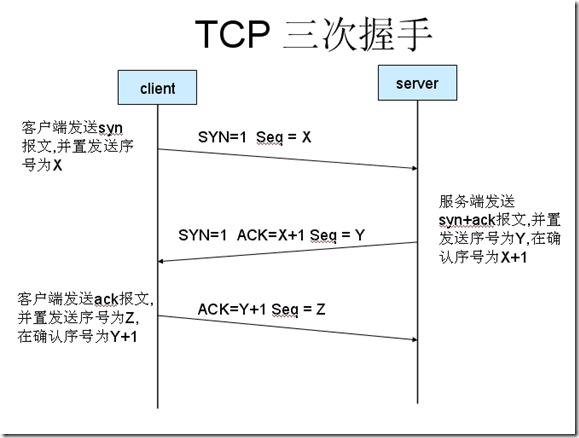
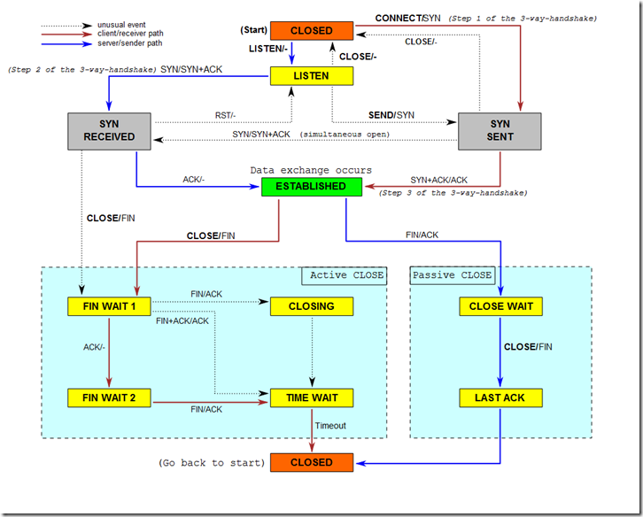

# **TCP3次握手，4次挥手过程**

##   **1、建立连接协议（三次握手）**

1. 客户端发送一个带**SYN标志**的TCP报文到服务器。这是三次握手过程中的报文1。
2. 服务器端回应客户端的，这是三次握手中的第2个报文，这个报文同时带ACK标志和SYN标志。因此它**表示对刚才客户端SYN报文的回应；同时又标志SYN给客户端，询问客户端是否准备好进行数据通讯**。
（3）客户必须再次回应服务段一个ACK报文，这是报文段3。

### 3次握手时序图
 [

 ## **为什么需要“三次握手”**

​      在谢希仁著《计算机网络》第四版中讲“三次握手”的目的是“为了防止已失效的连接请求报文段突然又传送到了服务端，因而产生错误”。在另一部经典的《计算机网络》一书中讲“三次握手”的目的是为了解决“网络中存在延迟的重复分组”的问题。这两种不用的表述其实阐明的是同一个问题。
​      谢希仁版《计算机网络》中的例子是这样的，“已失效的连接请求报文段”的产生在这样一种情况下：client发出的第一个连接请求报文段并没有丢失，而是在某个网络结点长时间的滞留了，以致延误到连接释放以后的某个时间才到达server。本来这是一个早已失效的报文段。但server收到此失效的连接请求报文段后，就误认为是client再次发出的一个新的连接请求。于是就向client发出确认报文段，同意建立连接。假设不采用“三次握手”，那么只要server发出确认，新的连接就建立了。由于现在client并没有发出建立连接的请求，因此不会理睬server的确认，也不会向server发送数据。但server却以为新的运输连接已经建立，并一直等待client发来数据。这样，server的很多资源就白白浪费掉了。采用“三次握手”的办法可以防止上述现象发生。例如刚才那种情况，client不会向server的确认发出确认。server由于收不到确认，就知道client并没有要求建立连接。”。 主要目的防止server端一直等待，浪费资源。

 #  **2、连接终止协议（四次挥手）**

 由于TCP连接是全双工的，因此每个方向都必须单独进行关闭。这原则是当一方完成它的数据发送任务后就能发送一个FIN来终止这个方向的连接。收到一个 FIN只意味着这一方向上没有数据流动，一个TCP连接在收到一个FIN后仍能发送数据。首先进行关闭的一方将执行主动关闭，而另一方执行被动关闭。
1. TCP客户端发送一个FIN，用来关闭客户到服务器的数据传送（报文段4）。
2. 服务器收到这个FIN，它发回一个ACK，确认序号为收到的序号加1（报文段5）。和SYN一样，一个FIN将占用一个序号。
3. 服务器关闭客户端的连接，发送一个FIN给客户端（报文段6）。
4. 客户段发回ACK报文确认，并将确认序号设置为收到序号加1（报文段7）。

[

**为什么需要“四次挥手”**   
那可能有人会有疑问，在tcp连接握手时为何ACK是和SYN一起发送，这里ACK却没有和FIN一起发送呢。原因是因为tcp是全双工模式，接收到FIN时意味将没有数据再发来，但是还是可以继续发送数据。

## **握手，挥手过程中各状态介绍**

> **3次握手过程状态：**
> > LISTEN: 这个也是非常容易理解的一个状态，表示服务器端的某个SOCKET处于监听状态，可以接受连接了。
> 
> > SYN_SENT: 当客户端SOCKET执行CONNECT连接时，它首先发送SYN报文，因此也随即它会进入到了SYN_SENT状态，并等待服务端的发送三次握手中的第2个报文。SYN_SENT状态表示客户端已发送SYN报文。（发送端）
>
> > SYN_RCVD: 这个状态与SYN_SENT遥想呼应这个状态表示接受到了SYN报文，在正常情况下，这个状态是服务器端的SOCKET在建立TCP连接时的三次握手会话过程中的一个中间状态，很短暂，基本上用netstat你是很难看到这种状态的，除非你特意写了一个客户端测试程序，故意将三次TCP握手过程中最后一个ACK报文不予发送。因此这种状态时，当收到客户端的ACK报文后，它会进入到ESTABLISHED状态。（服务器端）
> 
> > ESTABLISHED：这个容易理解了，表示连接已经建立了。
>

> **4次挥手过程状态：（可参考上图）**
> > FIN_WAIT_1: 这个状态要好好解释一下，其实FIN_WAIT_1和FIN_WAIT_2状态的真正含义都是表示等待对方的FIN报文。
> >
> > 而这两种状态的区别是：
> >
> > - FIN_WAIT_1状态实际上是当SOCKET在ESTABLISHED状态时，它想主动关闭连接，向对方发送了FIN报文，此时该SOCKET即进入到FIN_WAIT_1状态。而当对方回应ACK报文后，则进入到FIN_WAIT_2状态，当然在实际的正常情况下，无论对方何种情况下，都应该马上回应ACK报文，所以FIN_WAIT_1状态一般是比较难见到的，而FIN_WAIT_2状态还有时常常可以用netstat看到。（主动方）
>
> > FIN_WAIT_2：上面已经详细解释了这种状态，实际上FIN_WAIT_2状态下的SOCKET，表示半连接，也即有一方要求close连接，但另外还告诉对方，我暂时还有点数据需要传送给你(ACK信息)，稍后再关闭连接。（主动方）
>
> > TIME_WAIT: 表示收到了对方的FIN报文，并发送出了ACK报文，就等2MSL后即可回到CLOSED可用状态了。如果FIN_WAIT_1状态下，收到了对方同时带FIN标志和ACK标志的报文时，可以直接进入到TIME_WAIT状态，而无须经过FIN_WAIT_2状态。（主动方）
>
> > CLOSING（比较少见）: 这种状态比较特殊，实际情况中应该是很少见，属于一种比较罕见的例外状态。正常情况下，当你发送FIN报文后，按理来说是应该先收到（或同时收到）对方的ACK报文，再收到对方的FIN报文。但是CLOSING状态表示你发送FIN报文后，并没有收到对方的ACK报文，反而却也收到了对方的FIN报文。什么情况下会出现此种情况呢？其实细想一下，也不难得出结论：那就是如果双方几乎在同时close一个SOCKET的话，那么就出现了双方同时发送FIN报文的情况，也即会出现CLOSING状态，表示双方都正在关闭SOCKET连接。
>
> > CLOSE_WAIT: 这种状态的含义其实是表示在等待关闭。怎么理解呢？当对方close一个SOCKET后发送FIN报文给自己，你系统毫无疑问地会回应一个ACK报文给对方，此时则进入到CLOSE_WAIT状态。接下来呢，实际上你真正需要考虑的事情是察看你是否还有数据发送给对方，如果没有的话，那么你也就可以close这个SOCKET，发送FIN报文给对方，也即关闭连接。所以你在CLOSE_WAIT状态下，需要完成的事情是等待你去关闭连接。（被动方）
>
> > LAST_ACK: 这个状态还是比较容易好理解的，它是被动关闭一方在发送FIN报文后，最后等待对方的ACK报文。当收到ACK报文后，也即可以进入到CLOSED可用状态了。（被动方）
>
> > CLOSED: 表示连接中断。

TCP的具体状态图可参考：

[